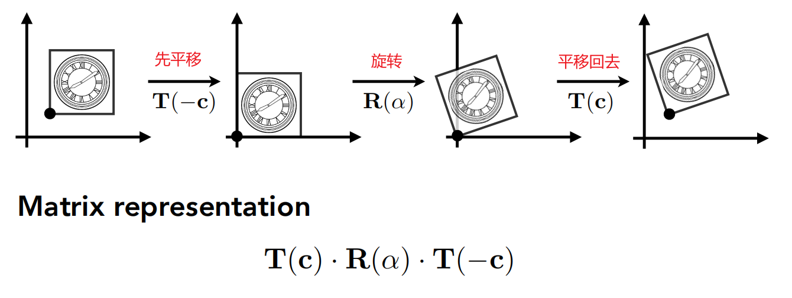
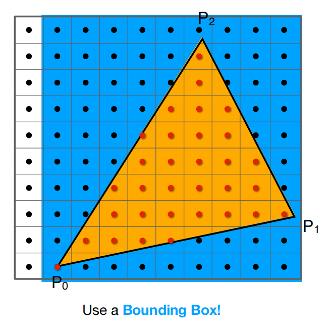
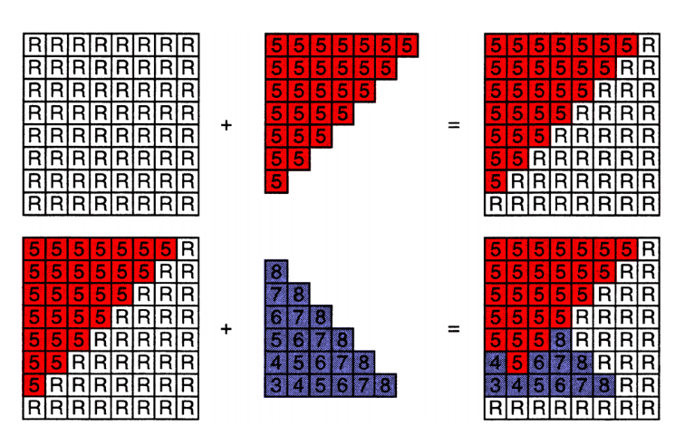
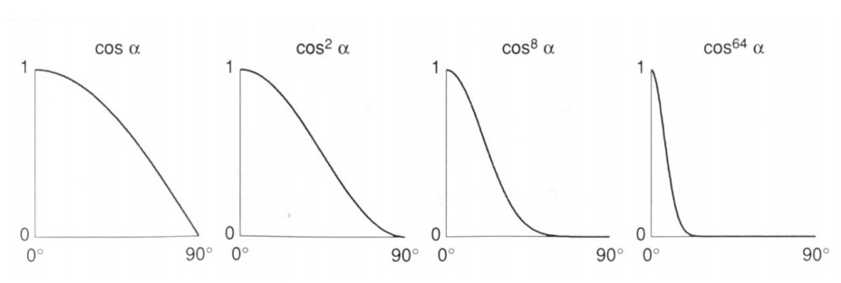
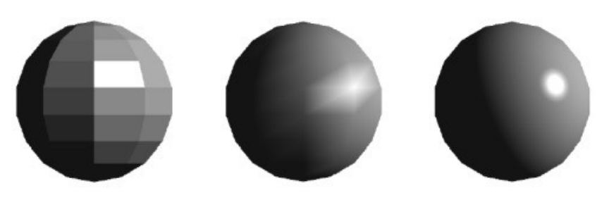
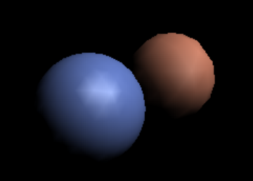
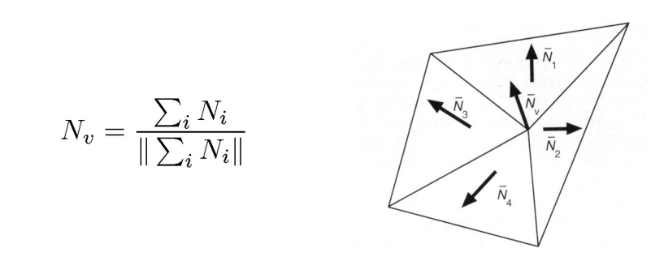
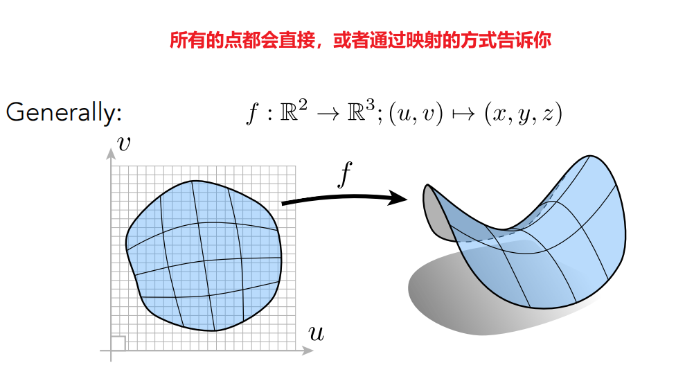
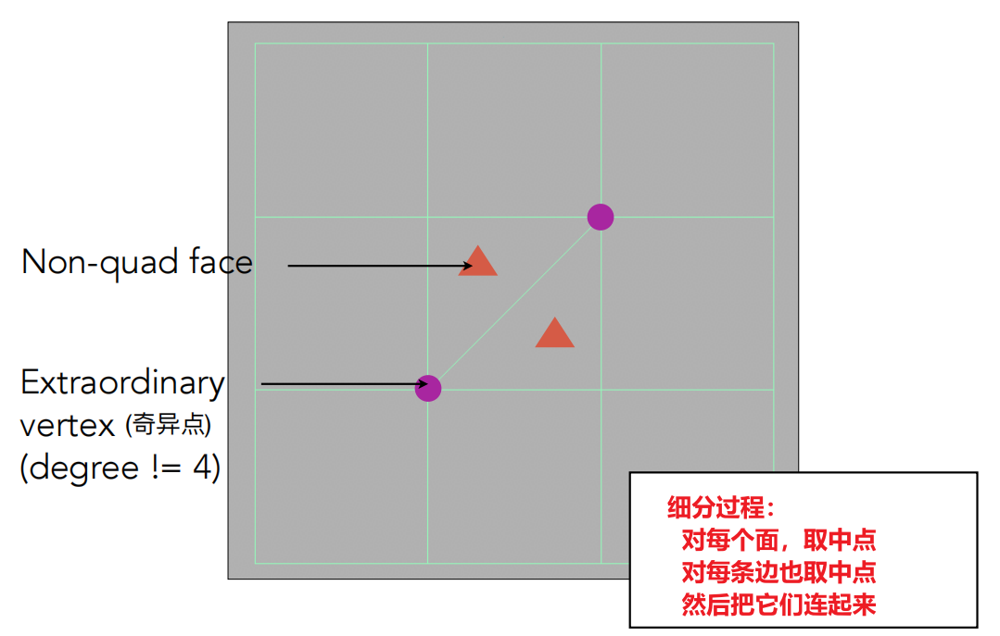
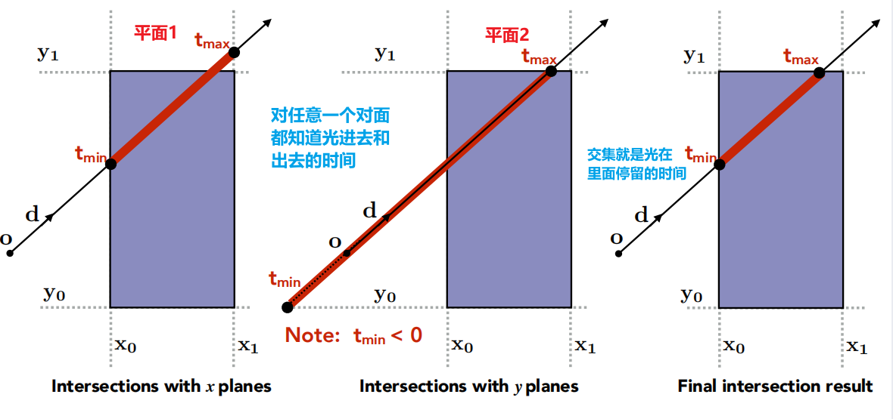

# 计算机图形学导论

本文的主要目的是复盘并总结计算机图形学这个学科常用算法与原理，会从基本的数学理论讲起，同时会附带部分算法的代码实现，由浅入深，只需初中的数学基础就行。主要参考了[GAMES101-现代计算机图形学入门](https://www.bilibili.com/video/BV1X7411F744)这门课（具体引用见文章末尾），同时附加上自己的理解。有兴趣的同学也可直接看视频。

## 基础铺垫

计算机视觉可大致分为光栅化（Rasterization）、曲线和网格（Curves and Meshes）、光追（Ray Tracing）、动画（Animation / Simulation）这四个方面。其中会着重介绍前3个方面，在此之前，让我们先来了解一些数学知识吧（非常重要，建议不要跳过）

### 向量

向量的计算公式如下：
$$
\vec{a} = \vec{AB} = B - A
$$
向量有方向和长度，没有绝对位置，将一个向量从坐标系中的一个位置平移到另一个位置，仍然是同一个向量

向量的长度可以这样表示
$$
\begin{Vmatrix}\vec{a} \end{Vmatrix}
$$
在计算过程中，我们总是喜欢用单位向量，即长度为1的向量。它可以暂时忽略长度，只关注方向。那么一个向量的标准化（把普通向量变为单位向量的过程）的计算公式如下：
$$
\widehat{a} = \vec{a} / \begin{Vmatrix} \vec{a} \end{Vmatrix}
$$
如果有两个向量，那么我们也可以对其做一些数学计算

**向量的加法**

平行四边形法则、三角形法则

向量的减法可以复用这两个法则，如a - b = a + (-b)

 **向量的乘法**

向量的乘法分为点乘和叉乘

**点乘**

点乘的结果是点积，即乘出来的结果是一个数，表示 $  \vec{a} $  在 $ \vec{b} $ 方向上的**投影**与 $ |\vec{b}| $ 的乘积。它反映了两个向量在方向上的相似度。结果越大越相似。基于结果可以判断这两个向量是否是同一方向，是否正交垂直，具体对应关系为：

同时点乘满足交换律和分配律，有如下性质

**叉乘**

叉乘又称向量积，其运算结果是一个向量，并且与这两个向量都**垂直**，是这两个向量所在平面的**法线向量**。使用右手定则确定其方向（右手握拳，四指从A旋转至B，最后大拇指所在方向就是法线方向）。

叉乘的性质如下（不满足交换律）

详细计算方法如下

**可以用叉乘来判断一个点是否在三角形内部**

根据右手定则可知：AB叉乘AP的结果向外，AB叉乘AC的结果向外，说明点P和点C在AB的同侧；

BC叉乘BP的结果向外，BC叉乘BA的结果向外，说明点P和点A在BC的同侧；

CA叉乘CP的结果向外，CA叉乘CB的结果向外，说明点P和点B在AC的同侧；

综上可知，P在三角形ABC的内部。

若发现点P与任意一个点不在一条边的同侧，则说明该点在三角形外。

**正交**

两个向量正交，就说明两两垂直

### 矩阵

一个M*N的矩阵就是M行，N列的数
$$
\begin{vmatrix} 0 & 1 \\ 3 & 4 \\ \end{vmatrix}
$$
**矩阵的乘法**

矩阵乘矩阵还是一个矩阵：(M x N) (N x P) = (M x P)

注意，A的列数必须与B的行数相等才能做矩阵乘法，否则不能乘。

**矩阵的性质**

矩阵满足分配律和结合律，不满足交换律

**矩阵的转置**

**逆矩阵**

**向量的点乘和叉乘都可以用矩阵的形式表示**

## 变换

### 线性变换

**缩放**

**翻转**

**切变**

**旋转**

这里可以多扩展一下，如果我们旋转 -θ，会得到一个怎样的矩阵呢？
$$
R_{-θ} = \begin{bmatrix}cosθ & sinθ \\ -sinθ & cosθ\\ \end{bmatrix}
$$
观察这一对矩阵，我们可以得到一个重要结论：**旋转矩阵的逆矩阵，就是他的转置**。牢记这个结论，后面会有重要应用。

**总结**：线性变换的方程如下：

### 齐次坐标

除了上述变换外，还有平移需要考虑。平移的方程如下

观察这个方程，我们可以看出来，它除了变量x、y之外，还有两个常量。像这种形式的方程，我们没有办法写成矩阵的形式。但很显然，我们并不想有这么个特殊的个例，为了将它写成矩阵的形式，我们可以将它的维度上升，变成三维，即齐次坐标。具体定义如下：

注：由于向量具有不变性，所以用0表示向量可以保护其在经过一系列变换之后仍能维持不变。

这样表示之后，我们便可以将平移方程转换成矩阵的形式

我们可以验证这样定义之后，对点和向量之间的运算是否会有影响：

- **向量 + 向量 = 向量 （0 + 0 = 0 ）**
- **点 - 点 = 向量 （1 - 1 = 0）**
- **点 + 向量 = 点 （1 + 0 = 1）**

那么点 + 点等于什么呢？这里需要补充一下，在齐次坐标系中，有如下变换规则

所以，**点 + 点 = 中点**

### 仿射变换

仿射变换是一个向量空间变换到另一个向量空间的过程。下图指从普通二维向量升维到三维齐次坐标的变换过程

那么，对上面的二维变换，我们同样可以用齐次坐标的方法来表示

### 逆变换

逆变换是指将变换复原的过程，很简单，只需要乘上变换矩阵的逆矩阵即可

### 组合变换

上述几种简单的变换可以组合在一起，形成比较复杂的变换。但是要注意，**矩阵不满足交换律**，所以变换过程的顺序很重要，同样的变换操作，如果顺序不对，就会得到不同的结果。

**当我们定义好变换操作和顺序之后，我们应该将变换矩阵从右往左写（左乘）**

### 复杂变换

对于一些比较复杂的变换，比如要求围绕模型的某一个顶点（不在原点）做旋转操作。我们可以将其平移到原点，旋转完之后再平移回去。这一点在后续的3D场景中被广泛运用。

## 3D变换

3D世界中的变换与2D的类似，依旧是升维成齐次坐标系再做矩阵运算

### 视图变换

我们可以通过这三个数，定义任意一个角度的旋转，这也叫做欧拉角

### 投影变换

#### 摆正摄像头

现在，我们已经知道了模型的旋转和各种移动操作，那么，我们应该怎样把这些结果展示到摄像机面前呢？要搞清楚这个问题，我们需要先定义一个摄像机。这里我们可以认为，假如一个摄像机的位置确定了，它的朝向确定了，并且向上方向也确定了，那么就可以说这个相机就定义好了（这里可以记一下下图中的几个符号，为了方便，后文主要用这几个符号来表示对应的方向）

在渲染的过程中，我们通常让相机保持不动，让物体运动。为了方便计算，我们通常把相机定在原点，让它往 -Z 轴看，向上方向沿着 Y 轴。这个过程用数学描述出来，需要有如下几个步骤：

- 将相机移动到原点
- 将 g 旋转到 -Z 轴
- 将 t 旋转到 Y 轴
- 将 g × t（叉乘代表这两个向量的法线方向） 旋转到 X 轴

很明显，这个过程很难写！

我们将这个视图变换矩阵定义为 $ M_{view} $，那么可以有如下的表达式

移动矩阵的写法很容易

难的是旋转矩阵。我们可以思考，将这三个方向都旋转到指定的轴，那么反过来想，就是要把 X 轴转向 (g × t)，Y 轴转向 t，Z 轴转向 -g。而这不正是旋转矩阵的逆矩阵吗

那么上面我们证明过，**旋转矩阵的逆矩阵，就是他的转置**，应用这个结论，我们可以知道，这个旋转矩阵应该就是上面矩阵的转置

好了，经过这个变换，我们已经能够把相机摆正到原点上了。那么接下来，就要开始把物体投影到相机上。目前投影操作分为正交投影和透视投影，先通过下图来直观的了解下两种投影方式，我们一个个来介绍。

#### 正交投影

简单的理解正交投影：就是把物体的Z轴拖到 0 的位置，然后把物体移动和缩放到 $ [-1\quad1]^2 $

流程如下：

这个过程很直觉，但我们也需要用数学的方法表示出来，其矩阵如下所示：

#### 透视投影

透视投影会造成近大远小的效果，也会导致本来平行的线变得不平行（参照下面的铁轨照片），但是这也是最符合人眼的投影方式

在此之前，我们先复习一下齐次坐标的性质：

$ (x, y, z, 1), \quad (kx, ky, kz, k!=0), \quad (xz, yz, z^2, z!=0) $在 3D 世界中都代表同一个点，如 $ (1,0,0,1) 和 (2,0,0,2)$都是点 $ (1,0,0) $

透视投影的步骤也很简单，就是把一个物体压成立方体，然后再做正交投影，注意**近平面n、远平面f，这两个平面在深度上保持不变**（即z轴不动，留给正交投影）（只是这两个平面的Z轴不变，其内部的点可能会发生改变）

这个变化最重要的就是要找到变化前和变化后的点之间的关系，我们可以用相似三角形来帮助理解

这里的n是投影之后的Z值，z是原本的Z值。通过相似三角形的性质，我们可以得出x和y的变化关系如下

这里补充一下我的个人理解：因为相机是朝向 -Z 轴的，在缩放的过程中，Z轴的数值是在不断变化的，但x，y的变化可以根据z的变化而确定，所以这里就可以用上述公式表达出他们之间的关系。但是Z我们怎么求呢，且看下面的分析。

我们先把这两个公式用齐次坐标的方法表达出来，得到下面的矩阵

提取出变化矩阵，可以得到下面的表达（如果不清楚的话，可以自己乘起来验证一下）

那么这个矩阵还剩下4个未知数，而我们还有两个如下性质没有使用：

- 近平面上的每一个点都不变
- 远平面上每一个点的Z轴的值都不变

首先运用第一个性质，我们可以得到下面的变化

由此可以解出两个未知数，并得到下面的公式

接着用第二个性质，可以写出如下变换，并得到下面的公式

由此组成的公式组就可以算出剩下的两个未知数了

至此，这个压缩过程的矩阵就全部表示出来了
$$
M_{persp->ortho} = \begin{bmatrix}
n & 0 & 0 & 0 \\
0 & n & 0 & 0 \\
0 & 0 & n+f & -nf \\
0 & 0 & 1 & 0
\end{bmatrix}
$$
接下来再做一次正交投影就完成了，故最终的透视投影的矩阵方程如下
$$
M_{persp} = M_{ortho}M_{persp->ortho} = \begin{bmatrix}
\frac{2n}{r-l} & 0 & \frac{l+r}{r-l} & 0 \\
0 & \frac{2n}{t-b} & \frac{b+t}{b-t} & 0 \\
0 & 0 & \frac{f+n}{n-f} & \frac{2fn}{f-n} \\
0 & 0 & 1 & 0
\end{bmatrix}
$$

#### 视口变换

经历了上面几次变换，我们能得到一个 $ [-1\quad1]^2 $的空间结构，最后需要将其转化到屏幕上，即转化到 $ [0, width]*[0, height] $中（这里暂时先不管Z，后面做深度的时候再用）。这一步就很简单了，我们直接套公式即可

$$
M_{viewport}= \begin{bmatrix}
\frac{width}{2} & 0 & 0 & \frac{width}{2} \\
0 & \frac{height}{2} & 0 & \frac{height}{2} \\
0 & 0 & 1 & 0 \\
0 & 0 & 0 & 1
\end{bmatrix}
$$

## 光栅化

光栅化的过程就是把模型渲染在屏幕上的过程。

这里我们先定义什么是屏幕，屏幕就是一个二维数组，数组里的每一个元素都代表一个像素点，一个像素能表示一种颜色，在一般情况下一个像素在同一时间只能发出一种颜色（有些屏幕可以发出多种）

屏幕中的每一个像素点我们都用整数坐标进行表示，最大最小值与分辨率相对应，考虑到每个像素都有一定的面积，我们定义(x+0.5,y+0.5)为该(x,y)像素的中心，如图中黑圈所示。

### 直线光栅化

#### DDA数值微分算法

首先当任何一条直线知道任意两点时都可以用$y = k x + b$来表示，其中k代表斜率，如果$∣ k ∣ < 1$ ，那么它的主要行进方向就是x轴，即x轴的变化要比y轴快，相反如果如果$∣ k ∣ > 1$ ，那么它的主要行进方向就是y轴，即y轴的变化要比x轴快。如下图所示：

我们分别就图上两种情况进行考虑(假设起点与终点给定(确定了直线方程)，就像图中一样)

- 当$∣ k ∣ < 1$时，从起点开始画起每次x = x+1， y = y+k, 并将y四舍五入，得到新的x，y就是像素点应该画的地方
- 当$∣ k ∣ > 1$时，从起点开始画起每次y = y+1， x = x+1/k, 并将x四舍五入，得到新的x，y就是像素点应该画的地方

#### 中点Bresenham算法

我们首先规定想要光栅化的线段的起点$P_0 ( x_0 , y_0 ) $与终点$P_1 ( x_1 , y_1 )$ ,则该直线方程可以用y = kx + b的形式来表示，定义$f ( x , y ) = y − k x − b$

中点Bresenham算法的思想其实也比较简单，我们在这里只给出0 < k < 1的情况，其它情况可以类推，除却起点与终点，我们每次的画点只会考虑右边或者右上的点两种情况(由斜率所决定的)，因此我们只需要在这二者之间做出选择。那么该依据什么进行判断呢，给出如下两种情况

第一：我们已经成功画出了前三个蓝色方格之后，所要考虑的便是第三个蓝色方格右边或者右上的橙色方格，此时我们取这两个橙色方格的中点，如图中圆圈符号所对应的那个点，倘若这个点在直线方程的下面，那么很明显我们应该选择右上的方格。

第二种情况：

此时中点位于直线方程的上方，此时选择右边的橙色方格。

至此，如何判断两种方格选择的条件已很明显，就是确定中点与直线的位置关系，这里就可以使用到一开始定义的$f ( x , y ) = y − k x − b$的方程了。

显然，当$f(x+1,y+0.5) > 0$的时候中点在直线上方，当$f(x+1,y+0.5) < 0$的时候中点在直线下方 （其中x+1，y+0.5是为了表示两个橙色方格的中点，此时x，y为前一个确定的像素坐标）

### 三角形光栅化

这里我们需要知道，数字世界几乎所有的模型都是由三角形组成的，数以万计的三角形组成了一个模型，一个个模型又组成了游戏世界。

那么为什么要选择三角形，而不是别的什么几何体呢？

- 它简单，三角形是构成几何中拥有边数最少的图形
- 能够保证三角形上的所有点都在同一个平面
- 并且很容易判定一个点是否在三角形内部

那我们怎样将三角形渲染在屏幕上呢？

这里用到了采样的方法，遍历屏幕上的各个像素点，如果该点在三角形内，则显示，否则不显示。这里复习一下判断一个点是否在三角形内部的方法：

好了，经过一遍采样之后，我们已经知道结果了

这里需要补充一句：如果像素点正好在三角形的边上，该怎么处理？这种情况发生的概率相当小，如果遇到了，随便怎么处理都行，忽略或者算作三角形内都可以。

当然，这样采样还是过于暴力，我们可以优化一下，不选择采样全部的点，而是只采样三角形附近的点，如下图所示

我们只需要采样蓝色区域内的点就可以了，因为蓝色之外的点必然不可能在三角形内。当然也有一些其他的优化方法，比如只找最左或者最右等等，这里不过多赘述。

好了，确定了像素点之后，我们需要将其展示在屏幕上

很明显，这并不是我们想要的结果。三角形周围出现了很明显的锯齿，用这种办法去渲染其他模型也会出现类似的情况

这个问题其实有一个很简单的优化方法，那就是先模糊，再采样

那么为啥模糊之后效果会好些呢？能不能先采样再模糊呢？想要探究这些问题，就得了解锯齿到底是啥，接着学下去吧

### 走样与反走样

#### 走样

锯齿其实是一种走样，说通俗点就是屏幕分辨率太低，像素太少，图形过于精细，无法用这么少的像素表达出图形本身的样子。换成数学一点的语言就是：**信号变化太快而采样太慢**。（懵逼也不要紧，看几个例子）

我们可以理解，视频就是在短时间内告诉播放图片，这本质上就是**对时间进行采样**，如果我们把这些图片拼接在一起，就会是这样，能看出运动员各个动作之间的间隔。

我们的显示屏有时候为了提高刷新率，会隔行显示，也就是**只显示奇数行或者偶数行的像素**，把其他的像素忽略，或者是重叠显示等等，这样做就能提高一倍的性能，并且显示效果也不会相差太多。但这也会导致“摩尔纹”，也就是下图这样的效果

我们的人眼也是一样，如果把一个格子的图片旋转起来，我们就会看到它似乎变成了一个车轮在转动。

这三种走样本质上都是一样的，就是上面提到的：**信号变化太快而采样太慢**

虽然这样说很有道理，但是缺少了数学表达，我们来加点数学元素进来（别慌，不难）。我们都知道频率，频率等于周期的倒数，同时**对于图像信号而言，我们认为两个像素间的颜色变化大则代表频率高，反之则是频率低**。

注意上图的三角函数，有一个叫**傅里叶**的人说，任意的图形都可以用这些三角函数表示，他提出的公式，叫**傅里叶级数展开**，如下所示（不用记，看看就行）

他还搞了个**傅里叶变换**，这个变换很有用，它可以将**时域转换成频域**。可以简单的理解一下，时域就是信号在不同时间的状态。频域就是用三角函数表示的东西，能**在不同的频率下观察信号**，它重点关注频率的变化。当然，这些公式知道干什么的就行，不用记。

了解这个东西干嘛的呢？它可以帮助我们更好的了解走样是怎么回事。

看上面的图片，我们能发现：频率慢的信号和我们的采样恢复结果基本一致，但是频率高的信号就不行了，就出现了严重的走样现象。所以说，**两种不同频率采样出来的结果无法区分就是走样**

#### 滤波

上面说到，一个时域或空间域上连续重复的信号可以通过傅里叶变换变到频域上。而图像本身就属于空间域上的一种信号，因此我们也可以通过傅里叶变换使其变成频域的表现形式。如下图，左边是一张图像，右边是傅里叶变换后的频谱。

对于右图的解读：**图像中心代表着低频率区域，越往外频率越高**，图像周围即是高频率区域。同时**亮度越亮，说明该频率的信息越多**，例如图中中心最亮，往外越来越暗，说明原始图像中低频信息最多，高频信息偏少。而关于图像的频率信息也就是像素间颜色变化，颜色变化越大则频率越高。同时我们也可以通过逆傅里叶变化，将右图变回左图。

接着我们将对这个图片进行几个经典的滤波操作。首先是高通滤波，高通的意思就是高频可以通过，也就是过滤掉低频的信号。如下图，我们去掉低频信号后得到如下图像。

有高通滤波自然也有低通滤波，即过滤掉高频的信号，如下图，图像变得模糊了，因为原本清晰的边界都被过滤掉了。

还有带通滤波，允许特定频段的波通过。例如下两图

#### 采样

接着我们再说说**采样**，采样是一个冲激函数（别深究），每一次冲激就代表采样一次，那么采样后的结果在这里我们就可以理解成这两个函数相乘所得到的结果。

如图，a函数代表信号，c函数为冲激函数代表采样，两个相乘得到e函数，即采样结果，也就是信号上各个点的结果。上述就是在时域上的采样原理。

那么采样在频域上是一个怎么样的过程呢？我们知道一个信号可以通过傅里叶变换变到频率上，如下图

a是我们时域上的信号，b是我们频域上的信号。上面说到频域其实是在频率上观察信号，因此b中的坐标系的横轴代表着频率，同时越往外代表频率越高。从b中我们可以看出，信号a大部分还是低频的信号（信号大部分都集中在原点附近）。

接着我们的冲击函数同样可以做一个傅里叶变换，得到的截图如下，c为我们的冲激函数，d为该函数的频谱。（具体为什么变成这样我们这里暂时不做过多的推理）

从中可以看出，将冲激函数傅里叶变换后以及还是冲激函数，只不过间隔发生了变化。

最后我们类比时域上采样的过程，对频域进行采样，过程如下。

你会发现我们在时域上是做乘积，而频域上是卷积。这背后的数学原理我们暂不深究，只需要知道，**在频域上，采样就是重复原始信号的频谱**就可以了。

从前面我们知道采样是根据冲击函数的频谱间隔在重复信号的频谱，那么就会存着这么一个问题，**冲击函数的间隔小于频谱的大小**，如下图：

可以发现，这种情况就会造成一部分的频谱重叠，这就是我们所谓的走样现象。因此**在频域角度上，走样就是频谱重复时发生了混合**。而重叠的这部分就是我们的高频信号，因为前面b中我们可以看出，一个信号的频谱图外面代表着高频信号，而重叠部分就是外面的这部分。

#### 反走样

那么解决方法是什么呢？最简单的自然是增加频谱中冲激函数的间隔，使其避免重叠现象。通过前面的学习，我们知道采样频率越高，即时域上的冲激函数间隔越小，走样越少，因此我们也可推出，**冲激函数在时域间隔越小，在频域上则间隔越大**。

当然了，增加采样频率是最容易理解的解决办法，但并不是最简单的，因为例如一个固定分辨率的屏幕，我们没法更改他的分辨率，即采样频率。那么应该怎么做呢？此时我们可以去除掉这些会被重叠的信号，如下图：

我们把原始信号的频谱的两头（即高频信号）去掉，然后依旧按原来的间隔排列，就会发现重叠的部分消失了。

这也就解释了为什么前面所说的先做模糊操作再采样可以实现反走样，**因为模糊操作等于做了个低通滤波，即去掉了高频的信号，减少了信号重叠的情况。**同时先采样在模糊的话，在频域上，采样后频谱已经混叠了，此时再去掉高频信号，等于是把混叠后的结果去掉两端（并不是每一段去掉两端），所以是错误的。

#### 超采样(MSAA)

除了先模糊后采样之外，我们还有一些别的抗锯齿方法，比如超采样。它的思想也很简单，就是多做一些采样，只要我们屏幕像素有足够多的采样点，那么就可能覆盖到所有的原始像素。然后我们只需要知道这些采样点分别与三角形的位置关系即可。具体流程如下图

虽然效果还挺不错的，但是代价也很明显，它的计算量增加了很多。因此为了更好的性能同时能够实现反走样，也对MSAA进行了很多的优化。例如增加的采样点并不是均匀分布的，而是按照一定的规则摆放，或者有些采样点能够被复用等等。

除了MSAA外，现代图形学还有各种各样的反走样操作，其中最具代表性的就是FXAA和TAA

#### FXAA

先得到带有锯齿的图，然后通过一些图像匹配的方法找到这些锯齿边界，然后将这些边界换成没有锯齿的边界，属于图像的后期处理。

#### 时间抗锯齿TAA

将采样点从单帧分布到多个帧上，使得每一帧并不需要多次采样增加计算量。

### 深度缓存

通过上面的光栅化，我们就可以将所有的三角形渲染到屏幕上了。但是似乎还有一个问题亟待解决，那就是模型与模型之间似乎很有可能存在遮挡关系。例如背着书包的人，正面看去书包和人是重叠的。并且对于单个三维物体而言，不同的面也是存在重叠关系的，例如书包的背面和正面。换句话说，所有要绘制的三角形，它们可能存在着重叠的关系，对于这些重叠的三角形，我们应该把谁显示在像素上？不绕弯子了，其实这里我们用到了深度缓存，还记得我们再视口变换里没有用到的Z值吗，这里就派上用场了。

那么什么是深度缓存呢，字面意思上似乎是把深度值缓存起来，实际上也确实是这样，但是这里的深度不再是每个三角形的深度，而是针对每个像素来处理。例如下图：

假设图中的小红块代表着一个像素，那么在这个像素中，R的深度肯定是小于P的深度的，我们假设在这个像素中R的深度为0.3，P的深度为0.5，然后我们会有个值用来存储这个像素对应的深度信息（默认值设为正无穷）。

此时我们就**不用管绘制顺序**了，例如：

1. 先绘制P，绘制到该像素时，先对比P在该像素的深度（0.5）和已存入的深度的大小（由于之前没有存过所以是默认值），0.5<正无穷，因此这个像素显示P的颜色，并存入深度值0.5。
2. 然后我们绘制R，对比R在该像素的深度（0.3）和已存入的深度的大小（0.5）,0.3<0.5，更新像素颜色，显示R的颜色，并更新深度值为0.3。

反之亦然，我们先绘制R，0.3<正无穷，显示R的颜色，存入0.3。然后绘制P，0.5>0.3，因为深度更大的不用显示，因此就不用管了。

在深度缓存算法中，我们会有两个buffer，如下：

- frame buffer：用来存储每个像素的颜色值
- z-buffer（depth buffer）：用来存储每个像素所对应的深度值，只保存值最小的那一个，默认值为正无穷。

对于深度缓存算法，其时间复杂度为 O(n)，因为它并不是一个排序操作（排序的时间复杂度最小也是 O(nlogn)），它仅仅只是求一个最小值，而不需要知道除了最小值外其他值的顺序如何。

了解了这些后，我们看下面这个例子就很清楚了：

图中每个格子代表一个像素，先后光栅化了一红一蓝两个三角形，根据不同的深度值得到的最终结果。

因为两个buffer的大小都是像素在屏幕上的宽和高的数量，因此这两个buffer我们都可以得到一幅图像，例如下图：

frame buffer对应的自然就是最终渲染出来的图像，而depth buffer对应的图像我们称之为深度图。

在深度图中越黑的代表越近，因为越近就是深度越小，即越接近于0，而在RGB颜色中，0即代表着黑色。反之越远，即深度越接近于1，即白色。这样就很容易看懂右边这幅深度图了。

虽然深度缓存看起来很美好，但是其实还有两个小问题：

- 虽然我们深度值是浮点型，但是还是可能存在相等的情况，那么若碰见深度值相同的情况，该如何显示？这里就需要我们特殊处理了。玩游戏中常见的闪烁效果可能就是这种情况所导致的。
- 对于带有透明度的物体，深度缓存的方法是无法处理的。

## 着色

通过上面的光栅化和深度缓存，我们已经能够把模型正确的渲染在屏幕上了。如下图所示，这是一排排的正方形。是不是看着总感觉缺了点什么

没有明暗交替，没有阴影，没有现实生活中的材质感。我们想看到的应该是下面这样的才对

这样就感觉真实了很多。再看看更复杂的案例

可以看到上图中的瓷器表面显示的有明有暗，其中甚至还有反射出来的倒影。而且我们一眼能看出图中的杯子是陶瓷杯子而不是金属杯子，塑料杯子，这都是因为着色结果给我们的材质感。

因此着色不仅仅只考虑物体本身的颜色，还要考虑物体的材质，环境的光照等等。

在图形学中，我们可以把**着色定义为在不同物体上应用不同材质的过程**。因为不同材质和光产生的相互作用就会不同，例如反射率，折射等。和光的不同作用就会显示出不同的结果，因为我们能看见物体都是因为光线进入了人眼。

在研究具体的方案之前，我们先大致了解一些着色需要关注哪几个点

首先是**高光**，这个我们生活中很常见，可以理解为在材质上经常能看到一块亮斑；

然后是**漫反射**。漫反射是指光打到物体上，然后被反射到四面八方的过程；

接着是**环境光**，上图中的杯子背部明明没有面对光源，但依旧能够被照亮，这就是环境光。

那么接下来，我们就围绕这三个方面来详细讲一下着色是怎么回事。（这其实就是大名鼎鼎的Blinn-Phong模型）

### Blinn-Phong模型

#### 漫反射

计算漫反射其实是个相对繁杂的过程，我们需要先理解反射的定义，然后算出光能的辐射，从而算出物体能接收到的光能，最后算出物体反射出去的能量。但是每一步都不难，加油看下去吧！

**反射**

首先来看看反射是怎么回事。为了方便分析，我们通常会将物体表面细分成一个个着色点，也可以理解成是物体表面每一块极小区域受到光照的结果。这样的好处就是，即使物体表面是曲面，我们也可以把一个着色点当作是一个平面，如下图：

根据每个着色点，我们可以有如下一些定义：

1. 既然是平面，那么我们就可以定义其对应的法线，即图中的 n 向量。
2. 光源对应着色点的方向，即图中的 l 向量，可通过光源位置减去着色点位置然后归一化得到，若多个光源，则每个光源有一个对应的方向。
3. 摄像机/人眼对应着色点的方向，即图中的 v 向量，可通过摄像机位置减去着色点位置然后归一化得到。
4. 表面的一些属性，例如颜色（color），亮度（shininess）等等。

注：上面提到的三个向量代表的都是**方向**，因此它们都为**单位向量**。

同时我们在考虑着色时，**不需要考虑阴影**，即不用考虑某个着色点的光照被其他物体遮挡的问题。我们只考虑该着色点本身的各个属性即可，这也是着色的局部性，因此**着色过程中也不会产生阴影**。

**Lambert的余弦定率**

接着我们来看下不同方向的光照对于着色点（着色点面积大小固定）的影响。

假设我们把一束光离散成几根光线，那么可以发现当我们的着色点和光照方向形成不同的夹角时，所接受到的光线数量也有所不同。因此着色点在不同角度下得到的光照能量不同，所以着色点所显示的亮度也应该有所不同。如下图：

从上图我们可以直观的看出光照角度对物体接受到的能量的影响。我们前面定义了光照方向为 l 向量，着色点方向即可以理解为法线方向 n 向量，因此它俩的夹角 θ （cosθ等于l和n向量的点乘）即可决定该着色点可以接收到多少的光照能量。

**光能的传播**

我们假设有一个点光源，它每时每刻会往均匀的往所有方向发射光。因为在同一个介质中，光速是相同的，因此假设在 t0 时刻点光源发射了光，那么在 t1 时刻，这些光的能量肯定都均匀的分布在一个球面上，如下图，展示的二维的情况：

因为能量守恒的原理，我们假设在传播过程中能量不损失，那么某一时刻的光在传播时，它所围成的球面会越来越大，但是总的能量依旧不变，因此球面上一个固定面积的能量随着传播是越来越少的。

球的面积公式为$ S=4πr^2 $，我们假设球半径为1时，单位面积上的能量为 I 。那么当球半径为r时，此时单位面积上的能量即为$ I/r^2$ ，即**成半径平方的反比进行衰减**。

**计算着色点接收的光能**

通过前面的介绍，我们就可以很轻松的计算出一个着色点接收到的光的能量。

如图，接着我们定义着色点到光源的距离为 r，光源在半径为1时对着色点的能量为 I，那么该着色点能接收到的能量L为：
$$
L_d = (I/r^2)max(0,n\cdot l)
$$

-  $I/r^2$ 代表光到达这个点的能量
- $max(0,n\cdot l)$ 代表这个点接收了多少能量

这里多说一句，为什么要 $max(0,n\cdot l)$ 呢？因为如果光源在着色点的背面，即 θ > 90° 的情况下，此时点乘为负数，我们就当做没有光照，取 0 

**光的颜色**

通过物理的学习，我们知道**可见光是由不同颜色的光波**所组成的，物体之所以有颜色是因为对光线不同程度的吸收所导致的。

例如物体把所有光线都吸收了，那么它就是黑色，反之如果都不吸收，那么就是白色，而红色就是吸收了除了红色以为所有的光。

因此我们可以假设着色点有一个属性，我们可以通过调整这个属性来达到显示不同的颜色，即吸收或反射哪些光。

**漫反射的计算**

到这一步，我们已经知道一个着色点能接收到多少能量L了，再结合颜色原理，我们只需要定义一个系数 $k_d$ ，即可决定该着色点最终的结果，公式如下：
$$
L_d = k_d(I/r^2)max(0,n\cdot l)
$$
例如 $k_d=1$ 即反射所有的光，那么就是白色， $k_d=0$， $l_d$就等于0，即不反射任何光，即为黑色。

通过不同的$k_d$值，我们就可以定义出着色点不同的颜色。如下图，光源在左上角，随着$k_d$的变大，被光照射的部分也越来越亮。同时可以发现相同$k_d$的情况下，球的左上角亮于中间部分，这也是Lambert的余弦定率的结果，因为法线和光照的夹角大，接收到的能量小，所以暗。

因为漫反射是将均匀的反射出去，所有我们**不管在任何方向看，结果都应该是一样的**，因此式子也和观察方向 v，没有什么关系。

注：在Blinn-Phong模型中，我们不会考虑摄像机和着色点的距离而产生的能量损失。也就是说不会有因为观察距离远，而导致物体看着变暗的效果。

#### 高光

高光是类似于镜面反射的结果造成的，我们知道镜面反射时，出射角和入射角的角度相同的。如下图，所有的入射光都会被反射到R方向附近上去，因此只有当我们的摄像机方向 v 和R离得很近时，我们才能看到反射光，因为光线很集中所以形成了高光效果。

也就是说，我们需要求出R的值来，才能知道R和v是否接近，然而这个R虽然能求，但是其实并不好求，有不少的计算量。Blinn-Phong模型在这里做了很聪明的一步，它发现我们只需要求出 l 和 v 的半程向量 h，然后把它和法线 n 作比较即可，如下图：

我们可以很容易的看出，如果v正好在出射方向上，那么n和h重叠，否则v离出射方向越远，n和h也会越远。这个半程向量h相当好求，它就是v和l组成的平行四边形的对角线，只需要把v和l相加，然后做个归一化即可。公式如下
$$
h = \frac{v+l}{||v+l||}
$$
然后要判断h和n是否接近，我们只需要知道它们的夹角即可，也就是说把 h 和 n相点乘即可。因此我们可得到如下公式：
$$
L_s=k_s(I/r^2)max(0,cos\alpha)^p
$$
$k_s$和漫反射的$k_d$类似，属于一个我们定义的系数，通常情况下高光是白色的，因此$k_s$的值也为白色相对应的值。

我们可以发现在高光的公式中，并没有考虑Lambert's 余弦定率（即没有 $max(0,l\cdot n)$ 项），在这里它被Blinn-Phong模型给简化掉了，主要关注的是是否能看见高光。

此外在高光的公式中还多了一个指数p，等于**对夹角的余弦值做了个幂运算**，为什么要这步操作呢？我们先来看看对余弦做幂运算会有什么结果，如下图：

如果没有p指数或者p=1，我们会发现假如夹角45度， $max(0,n\cdot h)$的值约等于0.7，也就是说依旧能看见很明显的亮度，但是我们不希望这种情况出现，因为45度左右我们就不应该能看见高光了。因此我们增加了指数p，从图中可以看出，当P的值越大， $max(0,n\cdot h)$的值就越快接近于0，这样就不会造成当夹角较大时，我们依旧能看见高光的现象了。通常情况下，在Blinn-Phong模型中p的取值会是在100-200之间。

我们来看看实际效果，如下图：

图中是漫反射+高光的效果，小球整体效果就是漫反射的结果，而其中较小的那些小圈就是加上高光后的结果。可以看出$k_s$ 越大，小圈越亮，因为反射的光越多。p越大，小圈越小，因为偏移一点角度就会使cos的值为0。

#### 环境光

因为光线可以不断的折射，因此即使没有被光源直接照射到的着色点依旧可能被间接光所照射到，从而产生亮度。但是这一部分的计算非常的复杂，因此在Blinn-Phong模型中，我们**假设**每个着色点接收到的环境的光**永远都是相同的**，定为 $I_a$ 。

如图，因为是环境光，因此和光源方向 $l$ 以及着色点法线n就没有关系，同样的应该不管从什么方向看，结果都应该是一样的，因此和视线v也没有关系。

因此我们就可以得到环境光的公式
$$
L_a=k_aI_a
$$
与其他公式类似，也会有个系数 $k_a$ ，用来控制能反射多少能量。因此环境光就是一个常量，可以当作代表的就是某一种颜色，也就是说物体上的每个着色点都带有这个颜色，因此整体效果也会比较平滑。

#### 最终效果

好了，在说完上面三个大方面之后，我们把它加起来看得到的最终公式如下：
$$
L=L_a+L_d+L_s=k_aI_a+k_d(I/r^2)max(0,n\cdot l)+k_s(I/r^2)max(0,n\cdot h)^p
$$
最终着色效果如下

使用上诉方法进行着色，就是我们所说的Blinn-Phong着色模型。当然了，里面很多都是假设得到的结果，因此Blinn-Phong着色模型得到的结果只是真实环境的一个近似。

### 着色频率

既然我们前面提到了着色是给每个着色点进行着色，而着色的方法/公式上面已经介绍了其中一种了，那么在实际的着色过程中，着色点到底是什么？

我们先来看看下面这张图：

上图中的三个球，从边缘我们可以发现它们属于相同的几何模型，但是我们可以看出着色出来的结果却是各不相同。

- 第一个球，我们可以明显看出它是对Mesh的每个面进行着色，也就是说我们的着色点实则是一个个的面。
- 第二个球，则是把每个面的顶点当做着色点进行着色，那么一个面的不同顶点就可能是不同的颜色，面内某一点的颜色可以使用插值的方法来计算。
- 第三个球，自然就是把每个像素当做一个着色点进行着色。

这些着色方法的不同，我们称之为着色频率不同，可以看出不同的着色频率会产生不同的效果。

#### 平面着色

平面着色就是对每个三角形面进行着色（shade each triangle），因此每个三角形内部的颜色都会是一样的，效果如下：

关于着色的计算，三角形的法线很好求得，将任意两条边进行叉乘即可。光源方向与距离和摄像机方向自然也是根据每个三角形而计算。可以看出，这种方法得到的效果并不算特别好。

#### 高洛德着色

高洛德着色，又称平滑着色（Smooth Shading），它则是针对顶点的着色（shade each vertex），效果如下：

我们只要求出每个顶点的法线，即可计算出每个顶点的着色，那么顶点的法线应该怎么计算呢？我们知道一个顶点可能连接着多个不同的三角形面（如下图），而每个三角形面都会有它各自对应的法线，那么这个顶点的法线值就是这些面的法线值的平均。

注：更准确的算法是，根据每个三角形的面积求一个权重，面积越大权重越高，然后根据权重来计算顶点的法线。

可以看出这种算法比平面着色要好了不少

#### 冯氏着色（Phong）

冯氏着色则是针对每个像素的着色（Shade each pixel），效果如下：

与之前提到的Blinn-Phong着色模型一样，都是由Phong发明的。

既然每个像素着色，那么自然要计算每个像素的法线，我们知道每个像素会对应到一个三角形的平面，但是它们的法线并不是平面的法线，而是根据三个顶点的法线来进行插值计算，如下图：

中间的这些即是像素的法线，根据两个顶点的法线通过重心坐标的方法计算得到。

可以看出，这种方法得到的着色效果就非常的好了。

可以看出，当模型面较少时，平面着色的效果最差，冯氏着色的效果最好。但是当模型的面越来越多时，三者的效果也基本相似。

## 纹理映射

上面我们说完了着色，可以知道一个模型反射出来的颜色是由一个系数k来决定的。但是你想想，一个模型只有一个颜色系数吗？那这样的话是不是一个模型只有一个颜色呢？如果是每一个点都有一个自己的颜色系数的话，怎么存储这么多系数呢？关于这类问题，我们用纹理映射来解决。

首先举个简单的例子，我们都知道地球仪，如果把地球仪的表层去掉，那它就是一个球体。这个球体就相当于模型本身，而被去掉的表层，就是它的纹理。所以说，纹理就是一个二维的平面。

我们只需要把三维的地球仪上的任意一个地方（一点），对应到二维地图上，就可以显示出正确的纹理了。

下面我们拿这个手来举例子，可以看到这个手上看起来挺真实的

它对应的纹理贴图如下

纹理与模型之间的对应关系，我们通常用二维坐标系来表达，不过不是xy，而是uv，但是它们的意义是一样的，**u代表纹理的横坐标，v代表纹理的纵坐标**。

我们知道不同的纹理，它们的大小可能都是都是不一样的，甚至有些可能是正方形，有些是长方形，因此纹理坐标uv的定义和纹理尺寸以及形状没有关系。我们认为对于任何一个纹理，它的**u和v的值都是从0到1**，例如uv(0,0)代表纹理的左下角，uv(0.5,0.5)代表纹理的中心的，uv(1,1)代表纹理的右上角。

例如这个手套的纹理，它的uv如下：

好了，看起来很不错，那么问题来了，我们怎么做才能让模型与纹理正确的对应上呢？

重心坐标派上用场了，当我们知道一个三角形三个顶点对应到纹理上的uv坐标后，我们就可以通过重心坐标来计算出该三角形内任意一点所对应的uv。然后我们通过uv坐标即可在纹理上采样到对应的颜色值作为改点的漫反射系数 $k_d$ 的值，这样就等于把改图贴到（映射到）了物体上。

### 重心坐标

先来看看重心坐标是什么，这里我不愿意用复杂来数学推导来给重心坐标下定义（我不知道为什么别人的推导公式那么长，我学不来），而是用一些直观的几何方法来解释什么是重心坐标。

如图所示，三角形内的每一个点都有一个重心的表示方法。对图中的红点，我们认为它的重心坐标是$(\alpha, \beta, \gamma)$，同时这三个数加起来必须为1，且都是非负的。$\alpha, \beta, \gamma$ 的值就是其对应小三角形与整个三角形的面积的比例。

对 $\alpha$ 来说，就是A点对面的三角形的面积与整个三角形面积之比，$\beta, \gamma$ 也是类似。那么三角形的顶点的重心坐标怎么表示呢？

很简单，如上图所示，A点的重心坐标就是(1,0,0)

如果我们知道三角形的顶点的坐标，想求任意一个点$(x,y)$的重心坐标，计算公式如下

因为$\gamma = 1-\alpha-\beta$，所以实际有意义的就只有$\alpha$和$\beta$，而$\alpha$和$\beta$也就是纹理中的u和v，这就对应起来了。重心坐标的用处很广，除了纹理，还可以用于计算颜色、位置、法线、深度等等方面，下面马上就会再用到。

### 模糊、锯齿

问题就此解决了吗？并没有，我们来看这张图

这张图看起来很模糊，而且存在很多锯齿。这是**因为我们纹理过小，在覆盖物体表面时被放大了所导致的。**

我们的纹理其实就是一张图片，因此它也存在自身的分辨率，即由像素组成，每个像素有自己的下标，**纹理上的像素我们常称为texel**。而我们物体表面最终会显示在屏幕上，屏幕自然也有它的像素，**屏幕像素我们称之为pixel**。

我们每个屏幕像素都会对应到三角形内的一个点，而三角形内的点会有它对应的uv坐标，然后我们通过uv坐标可以找到纹理上对应的纹理像素。也就是说**在使用纹理映射时，屏幕像素会对应到纹理像素上**。**当我们纹理太小的时候，我们多个屏幕像素会对应到一个相同的纹理像素上，所以产生了模糊或者锯齿**。

举个例子，例如我们屏幕像素(50, 50) 对应到纹理像素(5,5)，屏幕像素(51, 50) 对应到纹理像素(5.1,5)，屏幕像素(52, 50) 对应到纹理像素(5.2,5)，然后对于浮点数我们会四舍五入成整数，那么屏幕像素(50, 50)，(51, 50)，(52, 50)对应的纹理像素都是(5,5)

### 双线性插值

既然模糊了，我们就要对其进行优化，尽量让即使纹理过小，着色出来的效果也不错。而其中一个优化的技术就是双线性插值（名字高级，其实简单的一批），它的本质也是重心坐标的应用。

先说一下线性插值，可以类比为直线的重心坐标

我们有ABC三个点，C点在AB之间，ABC点的位置信息我们都知道，根据长度我们设$\frac{AC} {AB}=x$ ，$x$的范围为0-1，那么当我们知道AB的其他属性（例如颜色，法线等）时，C点对应的属性即为：
$$
C=lerp(x,A,B)=A+x(B-A)
$$
lerp就代表线性插值的意思，如果x=0，得到的就是A点。

好了，回到纹理这边，来看下图中的问题

双线性插值的计算方法是这样的：

总结一下：就是先算出横着的两个差值点，然后根据那两个差值点再做一次竖着的线性插值。

因为前后一共做了两趟线性插值（虽然第一趟做了两次），所以我们称之为双线性插值。双线性插值后，Q的颜色就会和边上四个像素结合起来，而不再简单的等于B的颜色。这样当多个屏幕像素对应到一个像素上时，这几个屏幕像素的颜色也会有一个线性的变化，而不再一模一样，模糊或锯齿的效果就得到减弱。

除了双线性插值外，还有**双三次插值（Bicubic interpolation）**，得到的效果就会更好。双三次插值取得则是周围十六个纹理像素做插值（该插值方法不是线性插值），具体原理这里就不过多介绍了。

### 摩尔纹

一些相对复杂的纹理容易发生摩尔纹现象

我们可以看到，图片的近处有锯齿，远处有摩尔纹。锯齿的原因我们知道了，是纹理太少，屏幕像素太多导致的。那么类比一下就知道了，**纹理太多而屏幕像素太少就会导致摩尔纹**。（插个题外话，从纹理图我们可以看出，我们的格子其实都是一样大小的。但是因为透视投影的**近大远小**效果，所以显得近处的格子大而梳，远处的格子小而密）

在走样那一章我们知道，摩尔纹属于欠采样所造成的，即我们很多纹理像素却只采样了其中一个像素的值。那么只需要利用**MSAA**的原理，即在一个像素内增加采样点，然后求个平均，来反走样解决问题。真的这么简单吗？看看效果

我们发现远处不再有斑斑点点了，但是也不太分辨的清楚，与原图相比起来还是不够好。有没有别的办法呢？当然有

### Mipmap

我们上面提到的双线性插值其实属于一种**点查询**方式，就是说我们知道纹理上的任意一点，要查出其对应的颜色值。而对于摩尔纹，我们要用的则是**范围查询**，即我们知道一定范围的纹理像素，要查询出它的平均值。

Mipmap就是一种可以帮我们实现范围查询的方法，**它速度快，但并不是特别的准确，结果是一个近似值，此外它只能做正方形的范围查询**。它的本质其实就是一张纹理生成一系列的纹理，如下图：

我们假设原本的纹理是n*n大小的（纹理大小也就是纹理像素的数量），为第0层。然后我们用它增加更多层的纹理，每一层的长宽大小都是上一层的一半，那么总共就会有 $log_n$ 层。这样我们只需要在使用前先生成好mipmap，然后使用时直接使用它做查询，就可以节省下使用时很多的计算时间，从而保证效果还不错。

你可能会情不自禁的算一下这种方法需要多用多少空间，其实很少，只需要多用三分之一就可以了。算的方法很简单，这里不多赘述，给一张图，相信你能看明白

接下来说一下它要怎么查：

上面我们说了mipmap只能进行正方形查询，因此我们就要把覆盖范围近似成正方形，我们假设边长为L。那么假如一个屏幕像素覆盖了4个左右的纹理像素，即L=2，那么我们自然要使用第一层的mipmap，而要是覆盖了16个左右像素，L=4，就应该用第二层的。也就是说**如果一个屏幕像素覆盖了L\*L个纹理像素，那么就应该使用 logL 层mipmap**。那么我们就要知道我们的一个屏幕像素到底覆盖了多少的纹理像素，也就是求L的值。

怎么算？例如我们屏幕像素(x,y) 对应的一块纹理像素的中心点为(u,v)，那么我们再取它**周边的一个屏幕像素**，例如(x+dx,y+dy)，**算出对应的纹理像素**，假设为(u+du, v+dv)，那么我们就可以近似的求出L的值。

再说直白点，就是找这个**屏幕像素**旁边的一个像素和上面的一个像素，看这两个**屏幕像素**对应的**纹理像素**与**原本的纹理像素**之间的距离，取大的那个。

### 三线性插值

前面我们可以通过计算L的值来计算出应该查询哪一层，但是实际情况下，从近到远，我们L的值是线性增长的，比如从1到2到3...到n。但是由于$Log_L$的值取得是整数（设为D），当我们L=1时，D=0，L=2时，D=1，但是当L=3到5时，D都等于2。也就是说当L=3时，不存在D=1.58的情况，那么就会造成屏幕像素的颜色不是线性变化的，而是突然改变的。如下图

为了追求更好的效果，那么我们能不能在知道D=1和D=2的mipmap时，求出D=1.58乃至其他浮点数的mipmap呢？可以，答案还是线性插值，如下图：

我们先用双线性插值求出D层和D+1层的值，然后再线性插值求出D+x层的值（x范围0-1），这样等于在双线性插值的基础上再做了一趟线性插值，所以我们称之为三线性插值。这样就可以使得mipmap层与层之间的颜色变化是连续的。使用三线性插值后，我们之前的模拟图效果就会变为下图所示，看起来丝滑多了。

### Ripmap

前面我们说了mipmap可以解决摩尔纹的问题，但是有些情况下，它的效果并不是很好

左边是我们想要得到的结果，而右边是mipmap得到的结果，可以发现在远处变得很模糊了，这是为什么呢？

因为我们的mipmap**只能做正方形的查询**，在计算覆盖范围时都是按照正方形去考虑的，而实际上屏幕像素的覆盖性质并不可能那么的完美

我们可以发现这种情况下，一个屏幕像素覆盖的纹理像素范围更多的是长方形，甚至是斜条，那么再用正方形去计算就会出现很多的问题，这也正是mipmap的不足之处。而针对覆盖范围更多是长方形的情况，我们有更好的做法，即Ripmap， 各向异性过滤。

Ripmap和mipmap的不同之处就是它可以支持长方形的查询，它生成出来的纹理如下：

左上角为原始纹理，在水平方向只进行宽度的压缩，在竖直方向只进行高度的压缩，那么压缩后的图片任意一点还原到原始图片时，代表的都是一个长方形的区域。

从图中我们也可大致看出，使用Ripmap会导致存储空间变为原来的四倍左右，造成较大的显存占用。但是当压缩的层级x越高，增加的空间也会越小，例如当x=5和x=10，其实图片大小差距不大，所以打游戏的时候，设置里可以开的越高越好。

Ripmap可以很好的解决覆盖范围为长方形的情况，但是对于更奇怪的覆盖范围，例如斜条等，同样不能很好的解决问题，对于这类情况我们还可以使用**EWA Filtering**来解决，当然运算量又会增加，具体EWA Filtering的实现原理，这里就不深挖了，有兴趣的老铁再细查吧。

### 其他应用

纹理不仅仅只能记录颜色，它还能记录环境光、位移、法线等等。（这里浅浅了解一下，后面有兴趣再深挖）

比如下图这种纹理，就可以把周围的环境光都记录在球面上，叫做光照贴图，它能够模拟出全局光照的感觉。但是缺点也很明显，因为是事先烘焙好的阴影，因此在运行时这些阴影不会受外界的影响而改变。

还有法线贴图，也叫凹凸贴图，它可以改变模型表面的法线。我们前面讲漫反射的时候提到表面的法线会改变光照。那么法线贴图就是通过设置一些假的顶点法线来制造出假的着色结果，来给人凹凸不平的感觉。因此利用**法线贴图并不会改变模型的几何信息**，即原本各个顶点位置的不变。

而与之相比的位移贴图，就是真的改变了三角形顶点的位置而产生凹凸感，效果也要好很多，如下图：

可以看出由于移动了顶点位置，边缘处依旧是凹凸不平的，包括阴影也是。

不过要使用位移贴图，首先需要三角形数量足够多，要跟得上位移贴图定义的频率。在DirectX中，提供了一个**动态细分**的方法，即一开始可以三角形偏少，当需要应用位移贴图时再自动细分三角形，即把一个三角形分成很多个小三角形，来匹配位移贴图的频率。

除此之外，还有一种**三维纹理**，它实际上是**三维空间上的一种噪声函数**。对于空间中任何一个点它都能够算出这个点对应的值是多少。例如大理石的纹理。

## 几何

学完了上面这些东西之后，我们已经能够把一些简单模型渲染出来了。但是你可能也想过，如果模型都是三角形组成的话，那不会有瓶颈么？对于一些复杂或特殊的模型怎么办呢？比如下图，还是用三角形硬刚吗？

很明显，这玩意很难用三角形组装起来。这个时候，我们就可以引入一些几何方法了。

### 隐式表达

隐式表达，也就是字面意思，你并不知道实际的点在哪里，只知道点与模型之间的关系。就比如说一个球的隐式表达式是这样的：
$$
x^2+y^2+z^2=1
$$
你并不知道这个球面上的点具体在哪里，但是对于任意一个$(x,y,z)$，你都能知道它是否在这个球上。

隐式表达有好处也有坏处，你可以很容易的判断一个点是否在表面，内部或者外部，但是相对它采样却很困难。

### 显式表达

与之相对的是显式表达，它会用uv的方式，告诉你模型上的所有的点，但是与之相应的，你很难知道其他的点是在模型内还是模型外

几何这一块，目前还真没有什么完美的解决办法，只能根据场景来选择合适的模型

### 距离方程

啥是距离方程呢？我们先来看看它的应用。加入我们要模拟这个过程，应该怎么做呢？

这是一个融合的过程，大致思路是判断它们之间的距离，然后融合在一块。理解起来蛮简单，但是似乎不好用数学方法表达出来。这个时候就要用到距离方程了，距离方程说白了就是记录了空间中的某个点到物体表面的距离。来看下图

说起来复杂，但是看起来是不是还挺好理解的。距离方程中，0所在的区域就是物理的表面，+表示该点在物体外面，-代表该点在物体内部。我们只需要把混合后的距离方程还原出来，就能得到融合之后的模型了。

其实，距离方程除了能用在物体融合上，它还有很强的表现力。两个简单模型的融合就能得到复杂的效果，如下图，基本你能看到的东西都是用距离方程搞出来的

距离方程的本质是一个隐式表达，除了用公式，还可以用水平集的方式，如下图

很直观，就是用一个网格来记录距离

### 贝塞尔曲线

曲线的作用自不必说，不论是静态的图片，还是三维动画，都需要绘制无数曲线。这里就介绍一种典型的曲线定义方法，贝塞尔曲线

我们先来直观的了解一下贝塞尔曲线是个啥，见下图

曲线的起点和终点我们都知道，贝塞尔曲线中的核心其实就是那两个控制点，那么它们是怎么控制一个曲线的呢？我们先来看只有一个控制点的情况

图中的 $b_0^1$ 和 $b_1^1$ 满足下面的关系（其实也就是线性插值的简单应用）
$$
\frac{b_0b_0^1}{b_0b_1}=\frac{t}{1}\\
\frac{b_2b_1^1}{b_2b_1}=\frac{1-t}{1}
$$

通过上面的方法确定了 $b_0^1$ 和 $b_1^1$ 之后，再对 $b_0^1$ 和 $b_1^1$ 做一次插值，就可以确定某一时刻t下曲线上的点 $b_0^2$ 的坐标了

理解了上面一个控制点的原理，那再加一个控制点就也没问题了，无非就是多做一次插值而已

下面的动画可以用来帮助理解（如果是pdf看不了的话，可以去网页上看）

了解了几何原理之后，我们需要用数学公式表达出来，也不难，就是插值的不断叠加

将其拓展到n阶的话，就是下面这样

其中$\begin{pmatrix}n\\j\end{pmatrix} = C_{(n,i)}=\frac{n!}{i!(n-i)!}$，这是排列组合里的式子，不是向量，不要弄混了

举个小例子，大家可以自行验算

下面是贝塞尔曲线的几个性质

- 必须经过起点和终点
- 曲线的方向永远朝向终点
- 仿射变换下保持不变
- 永远在控制点形成的凸包内

至于凸包是什么：就是几个控制点围成的最小多边形

几段不同的贝塞尔曲线可以连接成一个逐段曲线，如下图

但是可以发现，连接点的那一块会显得比较突兀。如果想要连续性的话，就需要两个控制点在同一条线上，且他们之间的距离要相等

### 曲面

了解了怎么形成曲线之后，是不是觉得曲线也不远了？其实曲面，无非就是不同的曲线的合集嘛，见下面的动图，你会秒懂的

原理就是先画出几条曲线，然后再在几个曲线之间做插值

### 几何处理

所谓几何处理，就是把现有模型做一些优化。比如说我们可以通过模型细分，给模型更加更多细节；简化则可以降低复杂度；而正则化就是优化三角形，使之变得规整（正则化的原理暂时先不讲，了解概念就行）

#### 细分

细分的核心思想就是引入更多的三角形，使模型变得更加光滑。

有这么一种细分的方法，叫Loop Subdivision（虽然叫loop，但和循环可没有关系）。它是通过区分新、老顶点，采用**先细分后调整**的方法来做的。具体是这么个操作：

**对于新顶点**，我们一般是在一条边上选取一个新点，然后根据它周围的点来做加权平均，以此更新他的位置

对于老顶点，我们需要同时考虑老顶点本身所在的位置，和其他邻居的位置，从而确定最终更新的位置，具体的更新算法如下

下图是细分的结果，看起来还是很不错的

我们除了对三角形进行细分外，还能对**网格**进行细分，下面来介绍一种典型的网格细分方法，叫Catmull-Clark Subdivision

在此之前先定义一个概念，叫奇异点，所谓奇异点，就是度不为4的点

通过上图所示的细分过程，我们仅需要做一次细分，就会神奇的发现**所有的非四边形都消失了，而奇异点的数量有所增加**

再做一次细分，会发现依旧不会出现非四边形，并且奇异点的数量也不会再有变化

多次细分之后，模型会变得越来越光滑

Catmull-Clark Subdivision的数学表示方法如下，也很容易理解，这里就不做详细分析

这种细分方法可用于多种不同的面，来看看它的效果，还是非常不错的

#### 简化

说完细分就该说简化了，简化的目的也很明确。很多时候我们不需要模型的密度那么高，只用能辨别这是个啥就OK。就比如打游戏的时候，我们其实并不关心远处某一个桌子上的摆件一样，扫一眼，知道那里有个东西就行了。

下图是具体的简化效果，三角形从30000到3000，其实也没有很多变化。哪怕是300，我们也能清晰的分辨出这是个头骨

简化的方法也很形象，叫边坍缩

看起来很直观，但是我们需要考虑两个问题：

- 我们该坍缩哪条边呢？
- 坍缩后的顶点放在哪里呢？

如果按照直观的想法，坍缩后的点，自然要根据它周围几个点来做平均。确实很直观，但是问题也很明显

如上图，我们会看到平均之后，这个面，会直接缩下去。这不是我们想要的。

于是就引入了**二次度量误差**来一次解决这两个问题

这里采用了机器学习的思想，所谓二次度量误差，就是取一个点，让这个点到其他面的距离最小

我们需要计算每一条边坍缩之后的点，及其这个点所带来的二次度量误差，然后取误差最小的点进行坍缩；随后更新其他受影响的点，再接着继续坍缩其他误差最小的点。

很明显这里用到了贪心的思想，可能最终解并不是最优的，但是通过观察结果，发现简化的结果还是相当不错的

## 光线追踪

### Shadow Mapping

在正式进入光线追踪之前，我们先了解一下Shadow Mapping。

这是一种生成阴影的方法，曾在游戏和电影中广泛使用。

它的本质是通过**光栅化**的思想，对比点与光源、点与相机的距离，从而判断是否有阴影。具体过程如下：

来看一个案例

上图的场景没有任何阴影，给人一种悬浮在空中的不真实感。针对上图的场景，从光源处拍摄一张深度图

然后在人眼处计算物体与光源之间的距离，再进行深度比对，可以看到绿色的地方就是光线能够照到的部分，非绿色的地方应该存在阴影

这里球面上的绿色看起来不均匀，是因为在计算机中浮点数之间很难判断相等，容易有误差，所以才会造成这种看起来有点脏的现象。

这种生成阴影的方法很经典，但是也存在一些问题

- 只能做硬阴影（边缘很锐利）
- 存在数值精度问题
- Shadow map的分辨率低会导致走样

先来说说第一个问题，硬阴影看起来十分锐利，软阴影则柔和很多。而硬阴影其实是本影，软阴影是半影，我们以日食的过程来阐述这都是什么东西，见下图

数值精度就是计算机内浮点数运算的问题；而Shadow map的分辨率本质上也是深度图的分辨率，也对应里我们在游戏里设置的阴影质量（低、中、高、极高），分辨率越高，阴影质量越好，但消耗的性能也越多；反之亦然。

### 光追算法

其实目前在游戏开发中，有不少还是继续采用的Shadow map，因为它对性能的要求相对较低，而且速度很快。但是之所以还是需要光追，是因为Shadow map在软阴影和间接光照等方面处理的仍然不够好，在某些场景下，仍有一些不真实感。可以看看下面的对比图

可以看出Ray Tracing有明显的优势，但之所以没有全面采用，是因为它慢。虽然效果很好，但是一帧画面可能要花几十分钟到一个小时。当然，目前工业界也已经有了很大优化，并且硬件性能也逐步提升，还是很有必要搞清楚它的理论知识的。

这里我们在讲光追之前，需要先明确几个前提：

1. 光是沿直线传播的（不考虑光的波动）
2. 光与光之间不会发生碰撞（虽然这在物理上也不正确）
3. 光路是可逆的（光能从光源到达人眼，自然也能从人眼沿原路径到达光源）

#### Whitted-Style光追

在Whitted-Style光追中，第三条前提尤为重要，因为它都是以人眼为起点放出射线，然后再校验射线碰到的物体与光源之间的可见性。具体步骤如下：

1、从眼睛出发，沿着每个像素发出一根光线。找到光线与物体相交最近的点

2、把这个最近的点与光源连接，判断时候能形成一条光路。如果可以，那就计算着色，并将着色效果写到像素上

3、考虑反射与折射现象，找到每次反射与折射过程中的弹射点。判断每个弹射点与光源之间是否能形成光路，如果可以，那就都加到像素上

好了，这就是Whitted-Style光追的核心算法原理了。

害，早着呢，这核心原理说的含糊，实际落地还有很多问题没有解决。比如光线与物体怎么判断相交、怎么找交点、怎么加速这个模型、怎么计算能量损失等等。不慌，我们一个个看。

**光线的定义**

在此之前，我们首先要定义一根光线，用数学的形式将之表达出来。定义方法如下：

**光线与圆的求交**

我们知道，圆上每一个点到圆心的距离等于半径。所以对圆上的任意一点 $p$ ，与圆心 $c$，半径 $R$ 之间存在这么个关系
$$
(p-c)^2-R^2=0
$$
而光线上任意一点 $r(t)$ ，也能用如下式子表示
$$
r(t)=o+td,0\leq t <	\infty
$$
所以如果光线与这个圆相交了，也就是说，在某个时刻，有 $r(t) = p$ ，满足下面的关系式（就是把$r(t)$ 换成了 $p$）
$$
(o+td-c)^2-R^2=0
$$

好了，这里面只有一个未知量 $t$，我们可以用公式来解出这个一元二次方程，结果如下
$$
对at^2+bt+c=0, 有\\
a=d\cdot d\\
b=2(o-c)\cdot d\\
c=(o-c)\cdot (o-c)-R^2\\
t=\frac{-b \pm \sqrt{b^2-4ac}}{2a}
$$
我们得到最终 $t$ 的公式之后，只需要判断 $t$ 是否有意义就可以了，不能是负数或者虚数，只要 $t \ge 0$ 就代表有交点

**光线与隐式表面求交**

了解了光与圆的求交方法之后，就可以很容易知道光与隐式表现的求交了，道理都是一样的

光线的表达式
$$
r(t)=o+td,0\leq t <	\infty
$$
隐式表面的表达式
$$
f(p)=0
$$
将光线代入隐式表面即可
$$
f(o+td)=0
$$
只要算出的 $t$ 是有意义的就说明有解

**光线与三角形求交**

我们都知道，模型是由很多个三角形组成的

那么想知道光线与物体相交的话，就直接判断光线是否与这个物体模型里的三角形求交就可以了。而判断光线是否与三角形求交也很简单，核心思想就两个

- 找到光线和平面的交点
- 看这个交点是否在三角形内

我们先来定义一个平面：平面就是一个法线 $N$ 和一个点 $p'$ ，平面上的任意一点 $p$ 和 $p'$ 的连线都与 $N$ 垂直，数学表达如下
$$
(p-p') \cdot N=0
$$
看起来有点复杂，但是还是蛮好理解的，法线用来定义方向，点 $p'$ 用来确定平面高度，示意图如下

现在我们知道平面公式了，也知道光线表达式了，接下来要做的就是把光线代入平面，就可以得到交点
$$
(p-p') \cdot N = (o+td-p') \cdot N =0
$$
解出
$$
t=\frac{(p'-o)\cdot N}{d \cdot N}
$$
确认 $t \le t < \infty $，即可

找到这个点后，我们用向量里的叉乘就可以很容易判断出这个点是否在三角形内了

这个方法很直观，但是人都是懒的，有没有办法直接判定光线是否与三角形有交点呢？答案是有的

还记得前面提到的重心坐标吗，我们直接把光线代入三角形的坐标公式就可以了

我们不详解线性方程组的求解和克莱姆法则，这是线性代数中的知识，说多了容易迷糊，对推导有兴趣同学去查一下相关资料就可以了

**加速**

到目前为止，我们已经知道怎么找光线与物体的交点了。

但是，一个场景里那么多模型，一个模型有那么多三角形，我们要找每个像素发出的光线与这么多三角形的交点，并且有可能的话还要算光线的多次弹射。那这不得慢死。
$$
算法复杂度=像素的数量×三角形的数量×光线反弹次数
$$

有没有办法可以加速一下呢？

很明显是有的

**包围盒**

我们知道，一个模型由很多个三角形组成，如果光线击中了模型中的三角形，那么就说明击中了这个物体。

那么我们为什么不直接算光线是否击中模型呢？因为这不好算，模型的组成太复杂了。

那有没有办法让模型变简单点，然后再算光线是否击中这个简单模型呢？

有的，这就是包围盒。很容易理解，看下图

就是用一个盒子或者一个球，来包裹住我们的复杂模型。**如果光线连包围盒都没击中，那更不可能击中里面的物体了**

好了，现在我们的问题就是要算光线是否击中包围盒

光线与圆的交点我们已经说了，与球的交点自然也是类似，就不再展开。这里主要说一下怎么与盒子求交。

目前用到一个比较经典的办法是**Axis-Aligned** **Bounding Box (AABB)（轴对齐包围盒）** 

这个方法里，**盒子的几个平面都是与坐标轴平行的，我们需要把盒子，看成是三个对面的交集**

在看三维之前，我们先看看二维矩形和光线的交点

再回到三维，要判断光线与盒子的交点，需要了解这么两个核心思想

- 只有光线进入了所有的对面，就算进入了盒子（这里的平面无限大，且不考虑光线与之平行的情况）
- 光线离开了任意一对对面，就离开了盒子

对每一对对面，我们都需要计算光线进入时间  $t_{min}$ 和光线离开的时间 $t_{max}$ 

对于3D的盒子，光线进入的时间 $t_{enter} = max\{t_{min}\} $，光线离开的时间 $t_{exit} = min\{t_{max}\}$

如果最后的 $t_{enter}<t_{exit}$，就说明**光线在这个盒子里待了一段时间，就必然与这个盒子有交点**

好了，到这里基本就算完了，但是还需要补充几个点

- **光线是个射线**，不是个直线，是有起点的，起点就是光源
- 如果$t_{exit}<0$，就说明光源在盒子的背后，必然没有交点
- 如果$t_{exit} \ge 0$ 并且 $t_{enter} < 0$，就说明光源在盒子里
- 只有 $t_{enter}<t_{exit} \&\&t_{exit}\ge0 $ 的时候，光线才与盒子有交点

最后补充一句，我们之所以要用3个对面来算，而不是直接算光线和平面的交点，是因为这有点复杂。如果用轴平面的话，只用看对应方向的分量就行了，这多简单，本质还是为了加速

到这里还没结束，还能更快。

上面是把物体当做包围盒来计算光线是否与之相交，还有另一种方法也用于加速，叫空间划分

说白了就是把空间划分了一个个格子，判断光线经过的格子里面是否有物体，没有物体就不管，有的话就再判断光线是否与物体相交

这个格子的密度也有讲究，不能太稀也不能太密，目前普遍使用的格子数大概是空间中的物体数*27

但是这个办法更适用于物体密集的场景，而非较为空旷的场景

确实，这个方法有一定的局限性，不过网格划分只是空间划分中的一种，我们也可以采用别的划分算法，比如以下三种

- 八叉树：顾名思义，沿着水平或竖直的方向，将空间划分成八份
- KD树：在合适的地方，沿着水平或竖直的方向砍一刀
- BSP树：找个方向砍一刀

这里我们主要介绍KD树，看起来十分容易理解，这也是相对较为常用的模型

如图，KD树是将空间不断划分，变成了一颗树，它只沿X轴、Y轴或Z轴划分，并且所有的物体都只存放在叶子节点上（就是图中带颜色的节点）

划分好之后，光线会以此经过这些节点，我们只需要顺着这棵树的结构，遍历下去就可以找到与之相交的物体了，过程见下图

这个看起来很美好，那么按照惯例，我们又要开始挑毛病了

首先，这个实现起来很难，因为一个物体可能存在于多个不同的格子里；并且还需要考虑三角形与盒子的求交

那么解决方案是什么呢？既然我们不好算物体具体归于哪个盒子，那就干脆通过物体划分好了

这种方法叫**Bounding Volume Hierarchy（BVH） 层次包围盒**

就是下图这种划分方法

我们不再执着于盒子与盒子是否相交，而且只关注物体，划分物体的方法也很多，比如这两种

- 总是选择最长的轴来划分
- 取中间的物体进行划分

大致计算逻辑如下

1. 如果光线没击中盒子，就不管
2. 如果光线击中的是叶子节点（带颜色的节点），就给盒子内所有物体求交，返回最近的那个
3. 如果击中的不是叶子节点，就对左右两个叶子节点都递归一次这个算法

#### 辐射度量学

上面讲完之后，我们就已经大致能模拟光照了。但是总感觉不太对，似乎过于随意了些，咱们对光照**连个单位都没有，也没有谈到任何物理模型**，最终的渲染效果怎么可能会准呢？

所以，再进一步研究之前，我们需要稍微了解一下**辐射度量学**（不怕，这个不难），用它来**准确的定义和模拟光线的传播过程**

这一章我们不用了解的很深，只需要记住并了解几个物理量，知道它们是干啥的就可以了。

在热学里，用于表示能量的是 $Q$ ，它的单位是焦耳 $J$，焦耳值越大，能量就越大。

单位时间内的能量就叫做功率，单位是瓦特。这个应该就比较熟了，家用电器的瓦数就代表了它在一定时间内消耗的能量值。而在光照这方面，虽然灯泡也是用功率表示，但灯的亮度用的是另一个物理量，叫**流明(lumen)**

流明，你也可以理解为，一定时间内，通过某一平面的光线数

然后我们还需要定义这么几个物理量，先看一眼，留个印象

**Radiant Intensity**
