# 计算机视觉导论

本文的主要目的是复盘并总结计算机视觉这个学科常用算法与原理，会从基本的数学理论讲起，同时会附带部分算法的代码实现，由浅入深，只需初中的数学基础就行。主要参考了[GAMES101-现代计算机图形学入门](https://www.bilibili.com/video/BV1X7411F744)这门课，同时附加上自己的理解。有兴趣的同学也可直接看视频。

## 基础铺垫

计算机视觉可大致分为光栅化（Rasterization）、曲线和网格（Curves and Meshes）、光追（Ray Tracing）、动画（Animation / Simulation）这四个方面。其中会着重介绍前3个方面，在此之前，让我们先来了解一些数学知识吧（非常重要，建议不要跳过）

### 向量

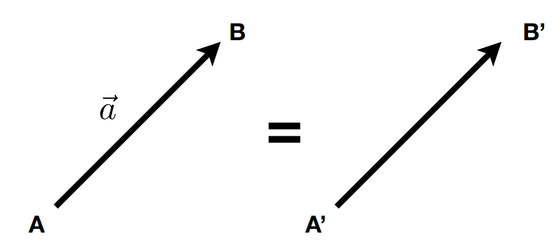

向量的计算公式如下：
$$
\vec{a} = \vec{AB} = B - A
$$
向量有方向和长度，没有绝对位置，将一个向量从坐标系中的一个位置平移到另一个位置，仍然是同一个向量

向量的长度可以这样表示
$$
\begin{Vmatrix}\vec{a} \end{Vmatrix}
$$
在计算过程中，我们总是喜欢用单位向量，即长度为1的向量。它可以暂时忽略长度，只关注方向。那么一个向量的标准化（把普通向量变为单位向量的过程）的计算公式如下：
$$
\widehat{a} = \vec{a} / \begin{Vmatrix} \vec{a} \end{Vmatrix}
$$
如果有两个向量，那么我们也可以对其做一些数学计算

**向量的加法**

平行四边形法则、三角形法则

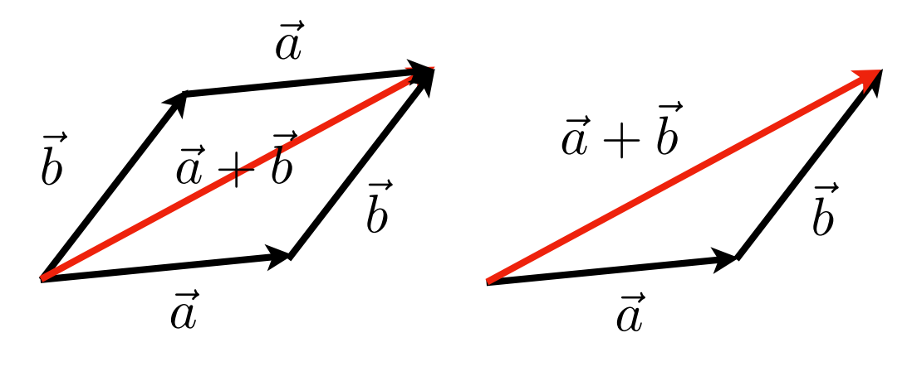

向量的减法可以复用这两个法则，如a - b = a + (-b)

 **向量的乘法**

向量的乘法分为点乘和叉乘

**点乘**

点乘的结果是点积，即乘出来的结果是一个数，表示 $  \vec{a} $  在 $ \vec{b} $ 方向上的**投影**与 $ |\vec{b}| $ 的乘积。它反映了两个向量在方向上的相似度。结果越大越相似。基于结果可以判断这两个向量是否是同一方向，是否正交垂直，具体对应关系为：

同时点乘满足交换律和分配律，有如下性质

**叉乘**

叉乘又称向量积，其运算结果是一个向量，并且与这两个向量都**垂直**，是这两个向量所在平面的**法线向量**。使用右手定则确定其方向（右手握拳，四指从A旋转至B，最后大拇指所在方向就是法线方向）。

叉乘的性质如下（不满足交换律）

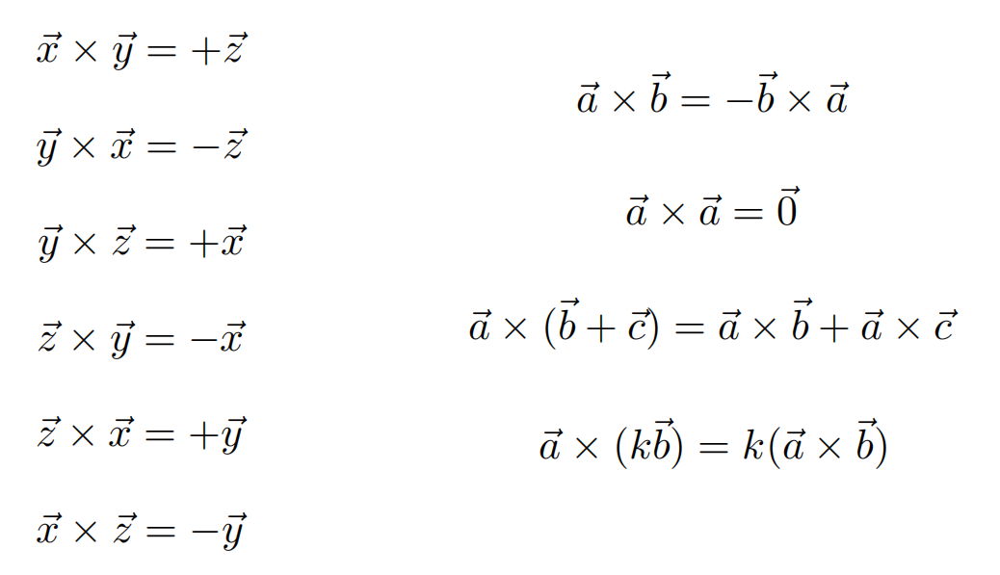

详细计算方法如下

**可以用叉乘来判断一个点是否在三角形内部**

根据右手定则可知：AB叉乘AP的结果向外，AB叉乘AC的结果向外，说明点P和点C在AB的同侧；

BC叉乘BP的结果向外，BC叉乘BA的结果向外，说明点P和点A在BC的同侧；

CA叉乘CP的结果向外，CA叉乘CB的结果向外，说明点P和点B在AC的同侧；

综上可知，P在三角形ABC的内部。

若发现点P与任意一个点不在一条边的同侧，则说明该点在三角形外。

**正交**

两个向量正交，就说明两两垂直

### 矩阵

一个M*N的矩阵就是M行，N列的数
$$
\begin{vmatrix} 0 & 1 \\ 3 & 4 \\ \end{vmatrix}
$$
**矩阵的乘法**

矩阵乘矩阵还是一个矩阵：(M x N) (N x P) = (M x P)

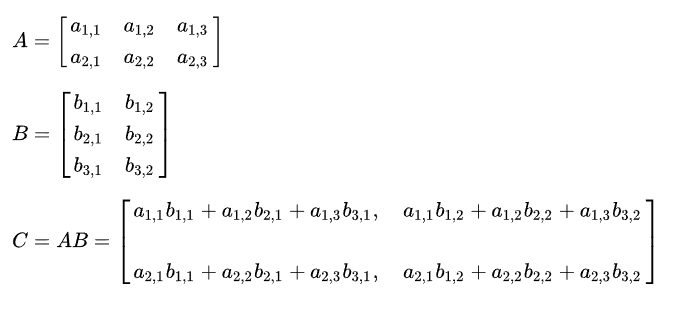

注意，A的列数必须与B的行数相等才能做矩阵乘法，否则不能乘。

**矩阵的性质**

矩阵满足分配律和结合律，不满足交换律

**矩阵的转置**

**逆矩阵**

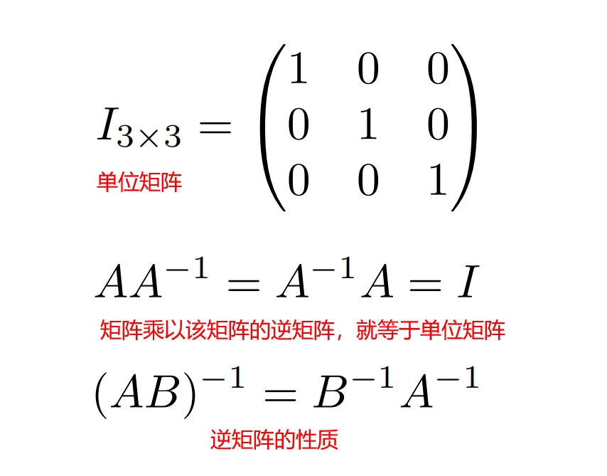

**向量的点乘和叉乘都可以用矩阵的形式表示**

## 变换

### 线性变换

**缩放**

**翻转**

**切变**

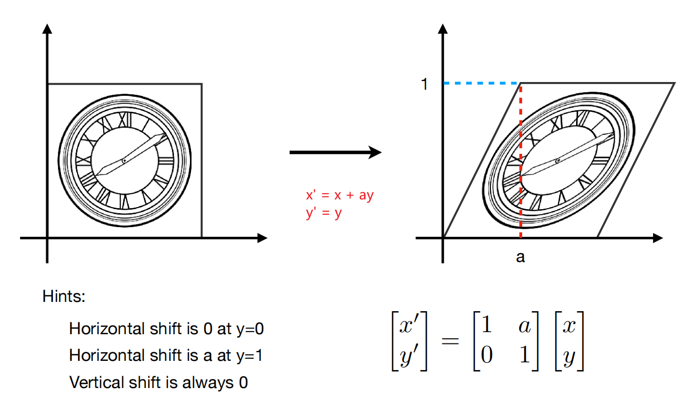

**旋转**

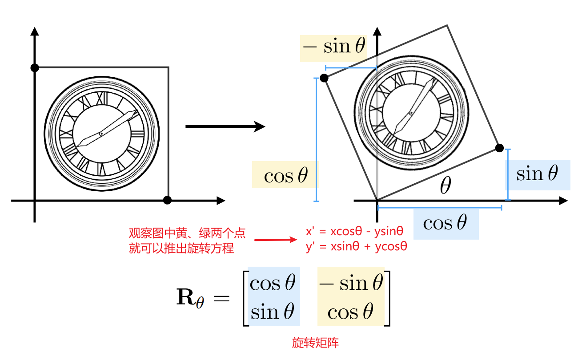

这里可以多扩展一下，如果我们旋转 -θ，会得到一个怎样的矩阵呢？
$$
R_{-θ} = \begin{bmatrix}cosθ & sinθ \\ -sinθ & cosθ\\ \end{bmatrix}
$$
观察这一对矩阵，我们可以得到一个重要结论：**旋转矩阵的逆矩阵，就是他的转置**。牢记这个结论，后面会有重要应用。

**总结**：线性变换的方程如下：

### 齐次坐标

除了上述变换外，还有平移需要考虑。平移的方程如下

观察这个方程，我们可以看出来，它除了变量x、y之外，还有两个常量。像这种形式的方程，我们没有办法写成矩阵的形式。但很显然，我们并不想有这么个特殊的个例，为了将它写成矩阵的形式，我们可以将它的维度上升，变成三维，即齐次坐标。具体定义如下：

注：由于向量具有不变性，所以用0表示向量可以保护其在经过一系列变换之后仍能维持不变。

这样表示之后，我们便可以将平移方程转换成矩阵的形式

我们可以验证这样定义之后，对点和向量之间的运算是否会有影响：

- **向量 + 向量 = 向量 （0 + 0 = 0 ）**
- **点 - 点 = 向量 （1 - 1 = 0）**
- **点 + 向量 = 点 （1 + 0 = 1）**

那么点 + 点等于什么呢？这里需要补充一下，在齐次坐标系中，有如下变换规则

所以，**点 + 点 = 中点**

### 仿射变换

仿射变换是一个向量空间变换到另一个向量空间的过程。下图指从普通二维向量升维到三维齐次坐标的变换过程

那么，对上面的二维变换，我们同样可以用齐次坐标的方法来表示

### 逆变换

逆变换是指将变换复原的过程，很简单，只需要乘上变换矩阵的逆矩阵即可

### 组合变换

上述几种简单的变换可以组合在一起，形成比较复杂的变换。但是要注意，**矩阵不满足交换律**，所以变换过程的顺序很重要，同样的变换操作，如果顺序不对，就会得到不同的结果。

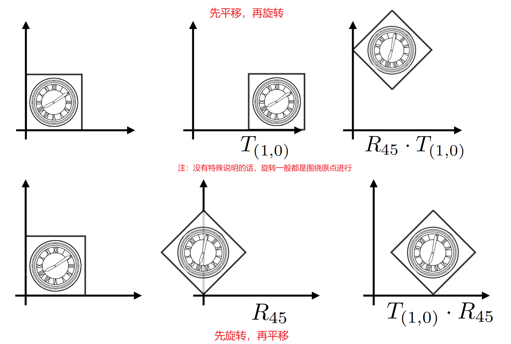

**当我们定义好变换操作和顺序之后，我们应该将变换矩阵从右往左写（左乘）**

### 复杂变换

对于一些比较复杂的变换，比如要求围绕模型的某一个顶点（不在原点）做旋转操作。我们可以将其平移到原点，旋转完之后再平移回去。这一点在后续的3D场景中被广泛运用。

## 3D变换

3D世界中的变换与2D的类似，依旧是升维成齐次坐标系再做矩阵运算

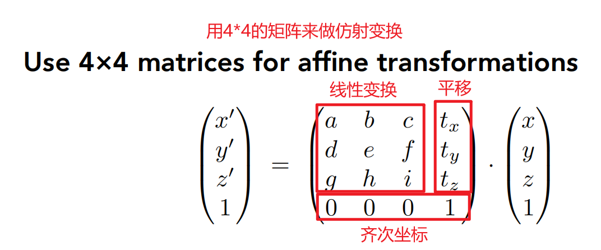

### 视图变换

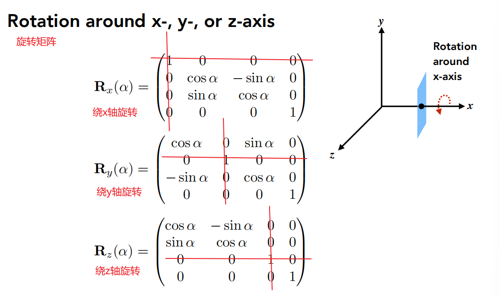

我们可以通过这三个数，定义任意一个角度的旋转，这也叫做欧拉角

### 投影变换

#### 摆正摄像头

现在，我们已经知道了模型的旋转和各种移动操作，那么，我们应该怎样把这些结果展示到摄像机面前呢？要搞清楚这个问题，我们需要先定义一个摄像机。这里我们可以认为，假如一个摄像机的位置确定了，它的朝向确定了，并且向上方向也确定了，那么就可以说这个相机就定义好了（这里可以记一下下图中的几个符号，为了方便，后文主要用这几个符号来表示对应的方向）

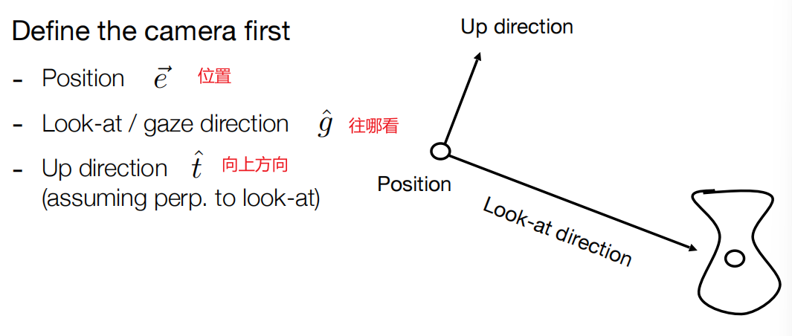

在渲染的过程中，我们通常让相机保持不动，让物体运动。为了方便计算，我们通常把相机定在原点，让它往 -Z 轴看，向上方向沿着 Y 轴。这个过程用数学描述出来，需要有如下几个步骤：

- 将相机移动到原点
- 将 g 旋转到 -Z 轴
- 将 t 旋转到 Y 轴
- 将 g × t（叉乘代表这两个向量的法线方向） 旋转到 X 轴

很明显，这个过程很难写！

我们将这个视图变换矩阵定义为 $ M_{view} $，那么可以有如下的表达式

移动矩阵的写法很容易

难的是旋转矩阵。我们可以思考，将这三个方向都旋转到指定的轴，那么反过来想，就是要把 X 轴转向 (g × t)，Y 轴转向 t，Z 轴转向 -g。而这不正是旋转矩阵的逆矩阵吗

那么上面我们证明过，**旋转矩阵的逆矩阵，就是他的转置**，应用这个结论，我们可以知道，这个旋转矩阵应该就是上面矩阵的转置

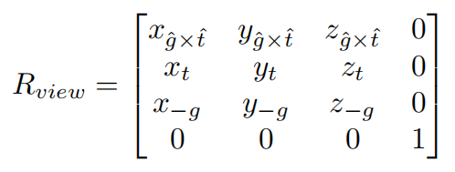

好了，经过这个变换，我们已经能够把相机摆正到原点上了。那么接下来，就要开始把物体投影到相机上。目前投影操作分为正交投影和透视投影，先通过下图来直观的了解下两种投影方式，我们一个个来介绍。

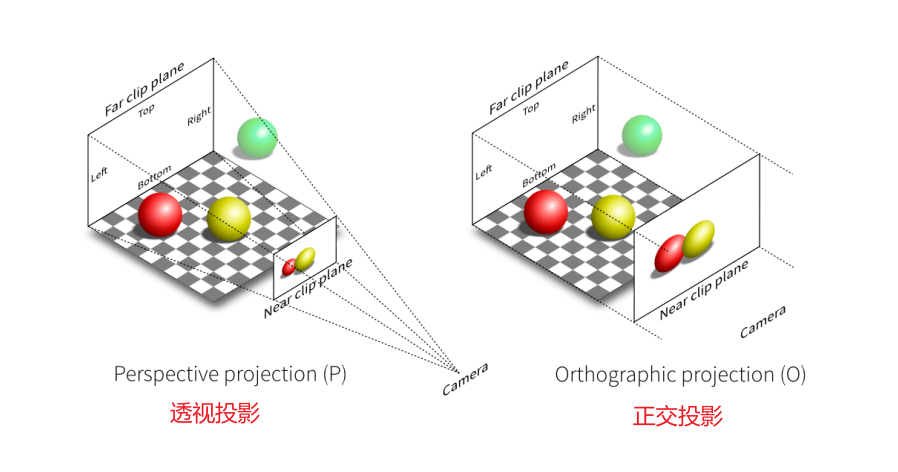

#### 正交投影

简单的理解正交投影：就是把物体的Z轴拖到 0 的位置，然后把物体移动和缩放到 $ [-1\quad1]^2 $

流程如下：

这个过程很直觉，但我们也需要用数学的方法表示出来，其矩阵如下所示：

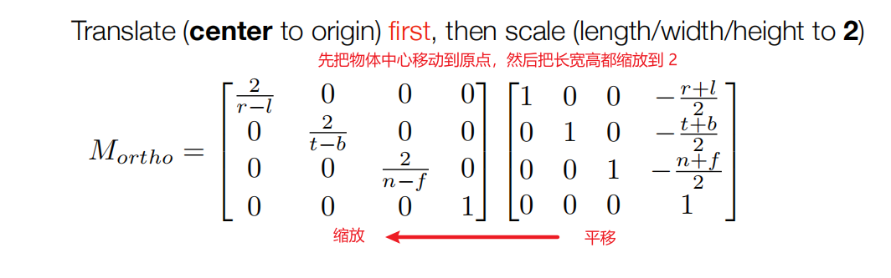

#### 透视投影

透视投影会造成近大远小的效果，也会导致本来平行的线变得不平行（参照下面的铁轨照片），但是这也是最符合人眼的投影方式

在此之前，我们先复习一下齐次坐标的性质：

$ (x, y, z, 1), \quad (kx, ky, kz, k!=0), \quad (xz, yz, z^2, z!=0) $在 3D 世界中都代表同一个点，如 $ (1,0,0,1) 和 (2,0,0,2)$都是点 $ (1,0,0) $

透视投影的步骤也很简单，就是把一个物体压成立方体，然后再做正交投影，注意**近平面n、远平面f，这两个平面在深度上保持不变**（即z轴不动，留给正交投影）（只是这两个平面的Z轴不变，其内部的点可能会发生改变）

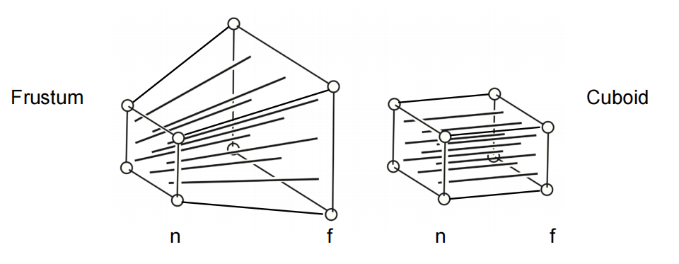

这个变化最重要的就是要找到变化前和变化后的点之间的关系，我们可以用相似三角形来帮助理解

这里的n是投影之后的Z值，z是原本的Z值。通过相似三角形的性质，我们可以得出x和y的变化关系如下

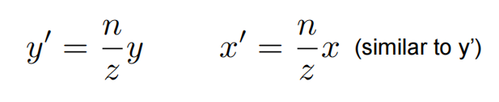

这里补充一下我的个人理解：因为相机是朝向 -Z 轴的，在缩放的过程中，Z轴的数值是在不断变化的，但x，y的变化可以根据z的变化而确定，所以这里就可以用上述公式表达出他们之间的关系。但是Z我们怎么求呢，且看下面的分析。

我们先把这两个公式用齐次坐标的方法表达出来，得到下面的矩阵

提取出变化矩阵，可以得到下面的表达（如果不清楚的话，可以自己乘起来验证一下）

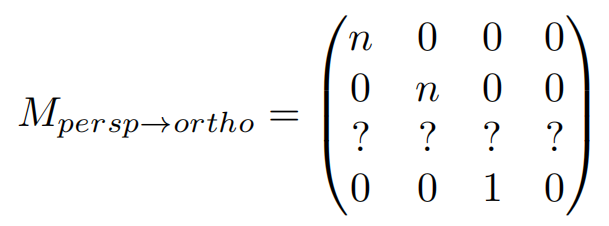

那么这个矩阵还剩下4个未知数，而我们还有两个如下性质没有使用：

- 近平面上的每一个点都不变
- 远平面上每一个点的Z轴的值都不变

首先运用第一个性质，我们可以得到下面的变化

由此可以解出两个未知数，并得到下面的公式

接着用第二个性质，可以写出如下变换，并得到下面的公式

由此组成的公式组就可以算出剩下的两个未知数了

至此，这个压缩过程的矩阵就全部表示出来了
$$
M_{persp->ortho} = \begin{bmatrix}
n & 0 & 0 & 0 \\
0 & n & 0 & 0 \\
0 & 0 & n+f & -nf \\
0 & 0 & 1 & 0
\end{bmatrix}
$$
接下来再做一次正交投影就完成了，故最终的透视投影的矩阵方程如下
$$
M_{persp} = M_{ortho}M_{persp->ortho} = \begin{bmatrix}
\frac{2n}{r-l} & 0 & \frac{l+r}{r-l} & 0 \\
0 & \frac{2n}{t-b} & \frac{b+t}{b-t} & 0 \\
0 & 0 & \frac{f+n}{n-f} & \frac{2fn}{f-n} \\
0 & 0 & 1 & 0
\end{bmatrix}
$$

#### 视口变换

经历了上面几次变换，我们能得到一个 $ [-1\quad1]^2 $的空间结构，最后需要将其转化到屏幕上，即转化到 $ [0, width]*[0, height] $中（这里暂时先不管Z，后面做深度的时候再用）。这一步就很简单了，我们直接套公式即可

$$
M_{viewport}= \begin{bmatrix}
\frac{width}{2} & 0 & 0 & \frac{width}{2} \\
0 & \frac{height}{2} & 0 & \frac{height}{2} \\
0 & 0 & 1 & 0 \\
0 & 0 & 0 & 1
\end{bmatrix}
$$

## 光栅化

光栅化的过程就是把模型渲染在屏幕上的过程。

这里我们先定义什么是屏幕，屏幕就是一个二维数组，数组里的每一个元素都代表一个像素点，一个像素能表示一种颜色，在一般情况下一个像素在同一时间只能发出一种颜色（有些屏幕可以发出多种）

屏幕中的每一个像素点我们都用整数坐标进行表示，最大最小值与分辨率相对应，考虑到每个像素都有一定的面积，我们定义(x+0.5,y+0.5)为该(x,y)像素的中心，如图中黑圈所示。

### 直线光栅化

#### DDA数值微分算法

首先当任何一条直线知道任意两点时都可以用$y = k x + b$来表示，其中k代表斜率，如果$∣ k ∣ < 1$ ，那么它的主要行进方向就是x轴，即x轴的变化要比y轴快，相反如果如果$∣ k ∣ > 1$ ，那么它的主要行进方向就是y轴，即y轴的变化要比x轴快。如下图所示：

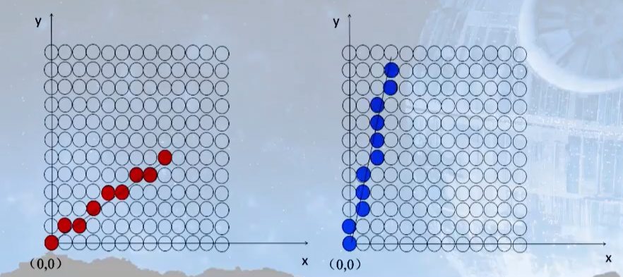

我们分别就图上两种情况进行考虑(假设起点与终点给定(确定了直线方程)，就像图中一样)

- 当$∣ k ∣ < 1$时，从起点开始画起每次x = x+1， y = y+k, 并将y四舍五入，得到新的x，y就是像素点应该画的地方
- 当$∣ k ∣ > 1$时，从起点开始画起每次y = y+1， x = x+1/k, 并将x四舍五入，得到新的x，y就是像素点应该画的地方

#### 中点Bresenham算法

我们首先规定想要光栅化的线段的起点$P_0 ( x_0 , y_0 ) $与终点$P_1 ( x_1 , y_1 )$ ,则该直线方程可以用y = kx + b的形式来表示，定义$f ( x , y ) = y − k x − b$

中点Bresenham算法的思想其实也比较简单，我们在这里只给出0 < k < 1的情况，其它情况可以类推，除却起点与终点，我们每次的画点只会考虑右边或者右上的点两种情况(由斜率所决定的)，因此我们只需要在这二者之间做出选择。那么该依据什么进行判断呢，给出如下两种情况

第一：我们已经成功画出了前三个蓝色方格之后，所要考虑的便是第三个蓝色方格右边或者右上的橙色方格，此时我们取这两个橙色方格的中点，如图中圆圈符号所对应的那个点，倘若这个点在直线方程的下面，那么很明显我们应该选择右上的方格。

第二种情况：

此时中点位于直线方程的上方，此时选择右边的橙色方格。

至此，如何判断两种方格选择的条件已很明显，就是确定中点与直线的位置关系，这里就可以使用到一开始定义的$f ( x , y ) = y − k x − b$的方程了。

显然，当$f(x+1,y+0.5) > 0$的时候中点在直线上方，当$f(x+1,y+0.5) < 0$的时候中点在直线下方 （其中x+1，y+0.5是为了表示两个橙色方格的中点，此时x，y为前一个确定的像素坐标）

### 三角形光栅化

这里我们需要知道，数字世界几乎所有的模型都是由三角形组成的，数以万计的三角形组成了一个模型，一个个模型又组成了游戏世界。

那么为什么要选择三角形，而不是别的什么几何体呢？

- 它简单，三角形是构成几何中拥有边数最少的图形
- 能够保证三角形上的所有点都在同一个平面
- 并且很容易判定一个点是否在三角形内部

那我们怎样将三角形渲染在屏幕上呢？

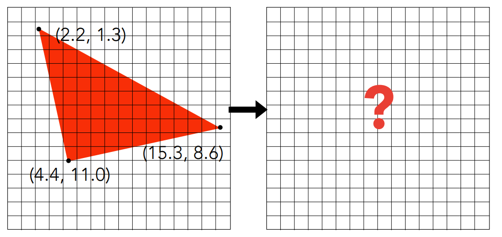

这里用到了采样的方法，遍历屏幕上的各个像素点，如果该点在三角形内，则显示，否则不显示。这里复习一下判断一个点是否在三角形内部的方法：

好了，经过一遍采样之后，我们已经知道结果了

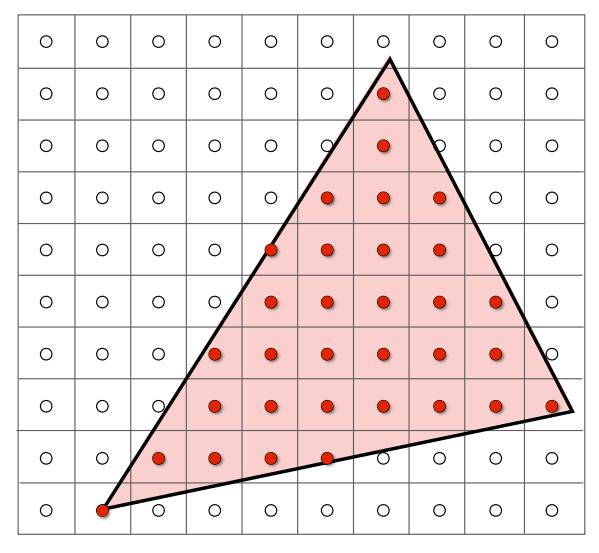

这里需要补充一句：如果像素点正好在三角形的边上，该怎么处理？这种情况发生的概率相当小，如果遇到了，随便怎么处理都行，忽略或者算作三角形内都可以。

当然，这样采样还是过于暴力，我们可以优化一下，不选择采样全部的点，而是只采样三角形附近的点，如下图所示

我们只需要采样蓝色区域内的点就可以了，因为蓝色之外的点必然不可能在三角形内。当然也有一些其他的优化方法，比如只找最左或者最右等等，这里不过多赘述。

好了，确定了像素点之后，我们需要将其展示在屏幕上

很明显，这并不是我们想要的结果。三角形周围出现了很明显的锯齿，用这种办法去渲染其他模型也会出现类似的情况

这忍不了，必须想办法优化！
